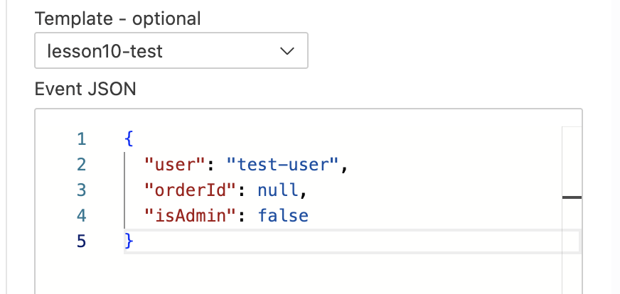
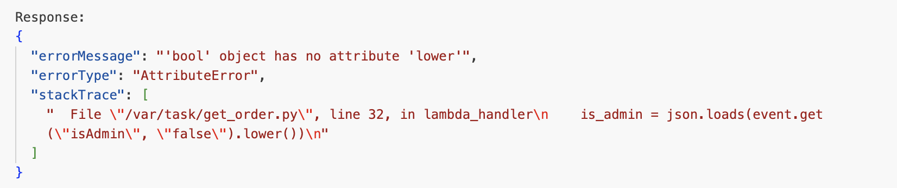
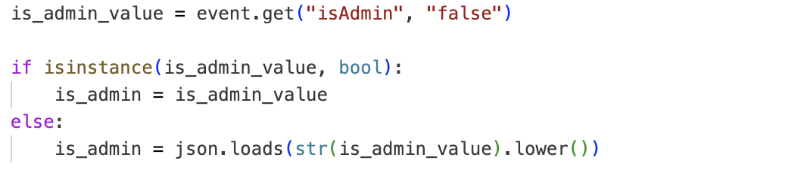
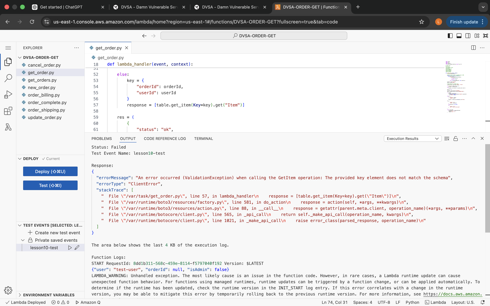

# Lesson 10: Unhandled Exceptions

## How to Use This Folder

1. Read this `README.md` from top to bottom.
2. Use the malformed test payload in `payloads/malformed_lambda_test_event.json` to reproduce the issue in the Lambda console.
3. Compare your result with the screenshots in the `evidence/` folder.
4. Review the safe validation example in `snippets/safe_validation_snippet.py`.
5. Apply the fix in `get_order.py`, then repeat the same test to confirm the unsafe exception is removed.

---

## 1. Vulnerability Summary

This lesson demonstrates an **Unhandled Exceptions** vulnerability in the DVSA serverless application.

The affected component is the `DVSA-ORDER-GET` Lambda function. When the function receives malformed or incomplete input, it does not validate the input safely before processing it. As a result, the backend can throw an internal exception and expose sensitive implementation details such as:

- Internal error messages
- Exception type
- Stack trace
- Source file path
- Exact failing line number

The security risk is information disclosure. Attackers can use leaked backend details to understand the internal application structure and prepare more targeted attacks.

---

## 2. Root Cause

The vulnerability exists because the Lambda function assumes that input fields always have the expected type and format.

In this case, the function expects `isAdmin` to behave like a string, then calls `.lower()` on it. However, the malformed test event sends `isAdmin` as a boolean value:

```json
{
  "user": "test-user",
  "orderId": null,
  "isAdmin": false
}
```

Because `false` is a boolean, not a string, the function crashes with:

```text
AttributeError: 'bool' object has no attribute 'lower'
```

The root cause is a combination of:

- Missing input type validation
- Unsafe assumptions about request fields
- No centralized exception handling
- Internal error details being exposed in the Lambda execution result

---

## 3. Environment

| Item | Value |
|---|---|
| Application | DVSA |
| AWS Region | `us-east-1` |
| Affected Lambda Function | `DVSA-ORDER-GET` |
| Source File | `get_order.py` |
| Backend Service | DynamoDB |
| Testing Method | Lambda Console Test Event |
| Tools Used | AWS Lambda Console, CloudWatch Logs |

---

## 4. Prerequisites

Before starting:

1. Have access to the DVSA AWS environment.
2. Open the AWS Console in the `us-east-1` region.
3. Go to **AWS Lambda**.
4. Open the function `DVSA-ORDER-GET`.
5. Have permission to create and run Lambda test events.

**Estimated time to reproduce:** 5–10 minutes.

No external helper script is required for this lesson because the vulnerability can be reproduced directly from the Lambda console using the included JSON test event.

---

## 5. Step-by-Step Reproduction

### Step 1: Open the Vulnerable Lambda Function

Go to:

**AWS Console → Lambda → Functions → `DVSA-ORDER-GET`**

Open the function page and select the **Test** tab.

---

### Step 2: Create a Malformed Test Event

Create a new test event named:

```text
lesson10-test
```

Use the following JSON payload:

```json
{
  "user": "test-user",
  "orderId": null,
  "isAdmin": false
}
```

This payload is intentionally malformed because:

- `orderId` is `null`
- `isAdmin` is a boolean instead of a string

**Evidence:**



---

### Step 3: Run the Test Event

Click **Test** inside the Lambda console.

Instead of safely rejecting the malformed request, the function throws an internal exception.

---

### Step 4: Observe the Exposed Error Details

The execution result exposes internal backend details similar to:

```json
{
  "errorMessage": "'bool' object has no attribute 'lower'",
  "errorType": "AttributeError"
}
```

The stack trace also reveals the internal source file path and exact failing line:

```text
/var/task/get_order.py
```

**Evidence:**



---

## 6. Attack Result Summary Before Fix

| What was tested | Result |
|---|---|
| Malformed `isAdmin` value as boolean | Lambda crashed |
| Safe client-side validation error | Not returned |
| Internal error message | Exposed |
| Exception type | Exposed |
| Source file path and line number | Exposed |
| Vulnerability confirmed | Yes |

The backend should not expose stack traces or internal file paths when invalid input is submitted.

---

## 7. Fix Strategy

The fix should be applied inside `get_order.py` in the `DVSA-ORDER-GET` Lambda function.

The function should:

- Validate the type of `isAdmin` before processing it
- Accept only expected boolean or string values
- Validate `orderId` before calling DynamoDB
- Wrap risky backend logic in safe exception handling
- Return a generic client-safe error message
- Log detailed error information only internally in CloudWatch

The key security improvement is that malformed input should be rejected safely before it reaches deeper backend logic.

---

## 8. Code / Config Changes

### Vulnerable Logic

The vulnerable logic treated `isAdmin` as a string and called `.lower()` directly:

```python
is_admin = json.loads(event.get("isAdmin", "false").lower())
```

This fails when `isAdmin` is a boolean value.

---

### Fixed Logic

The fix checks the input type before calling string methods:

```python
is_admin_value = event.get("isAdmin", "false")

if isinstance(is_admin_value, bool):
    is_admin = is_admin_value
else:
    is_admin = json.loads(str(is_admin_value).lower())
```

**Evidence:**



---

### Recommended Complete Validation

For the final secure version, validate both `isAdmin` and `orderId` before DynamoDB access:

```python
try:
    is_admin_value = event.get("isAdmin", "false")

    if isinstance(is_admin_value, bool):
        is_admin = is_admin_value
    elif isinstance(is_admin_value, str) and is_admin_value.lower() in ["true", "false"]:
        is_admin = json.loads(is_admin_value.lower())
    else:
        return {"status": "err", "msg": "Invalid request"}

    order_id = event.get("orderId")
    if not isinstance(order_id, str) or not order_id.strip():
        return {"status": "err", "msg": "Invalid request"}

except Exception:
    print("Invalid request received")
    return {"status": "err", "msg": "Invalid request"}
```

This prevents malformed values from reaching unsafe string handling or DynamoDB key operations.

---

## 9. Verification After Fix

After applying the `isAdmin` type-handling fix, the same malformed Lambda test event was executed again.

Before the fix, the function failed with:

```text
AttributeError: 'bool' object has no attribute 'lower'
```

After the fix, the specific `AttributeError` no longer occurred. This confirms that the unsafe boolean processing issue was removed.

However, because the same test event still contains:

```json
"orderId": null
```

DynamoDB may return a validation error because a null key does not match the required table key schema. This means the original `isAdmin` exception was fixed, but full hardening should also validate `orderId` before calling DynamoDB.

**Evidence:**



**Expected secure final behavior:**

```json
{
  "status": "err",
  "msg": "Invalid request"
}
```

No internal stack trace, source path, or detailed backend exception should be returned to the client.

---

## 10. Security Analysis

### Intended Logic

Under normal behavior, the order retrieval function should:

```text
Input Event → Validate Required Fields → Check Authorization → Query DynamoDB → Return Order Data
```

The function should never expose internal backend exceptions to the user.

---

### Table 1 — Intended vs. Observed Behavior

| Vulnerability | Intended Rule(s) | Artifacts Used | Normal Behavior Evidence | Exploit Behavior Evidence |
|---|---|---|---|---|
| Unhandled Exceptions | Invalid input must be safely validated and rejected without exposing internal backend details | Lambda test event, Lambda execution result, stack trace, `get_order.py` code | Valid requests should return order data or a safe generic validation error | Malformed payload triggered `AttributeError` and exposed internal file path, exception type, and stack trace |

---

### Table 2 — Deviation Analysis and Fix

| Vulnerability | Why This Is a Deviation | Deviation Class | Fix Applied | Post-Fix Verification | Latency |
|---|---|---|---|---|---|
| Unhandled Exceptions | The backend crashed on malformed input instead of returning a safe validation error | Intentional Misuse / Security-Relevant Abuse | Added safe type validation for `isAdmin` in `get_order.py`; recommended validating `orderId` before DynamoDB access | Re-running the same test removed the original `AttributeError`; complete hardening should return a generic error for null `orderId` | Not measured |

---

## 11. Lessons Learned

This lesson shows that even simple fields can become security problems when the backend assumes they are always correctly formatted. The function expected `isAdmin` to behave like a string, but a malformed boolean value caused an internal crash.

In serverless applications, unhandled exceptions are especially dangerous because backend failures can reveal stack traces, internal file paths, and implementation details. These details may help attackers understand the system and plan additional attacks.

The main lesson is that all external input must be validated before processing. Safe type checking, controlled error handling, and generic client-safe responses reduce information leakage and improve backend resilience.

---

## Repository Structure

```text
lesson10_unhandled_exceptions/
│
├── README.md
├── payloads/
│   └── malformed_lambda_test_event.json
├── snippets/
│   └── safe_validation_snippet.py
└── evidence/
    ├── figure1_malformed_lambda_test_event.png
    ├── figure2_unhandled_attribute_error_stack_trace.png
    ├── figure3_fixed_isadmin_type_validation.png
    └── figure4_post_fix_no_attribute_error.png
```
