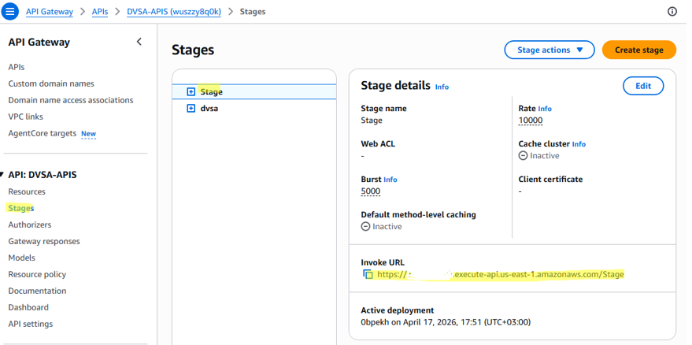
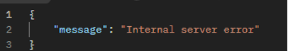
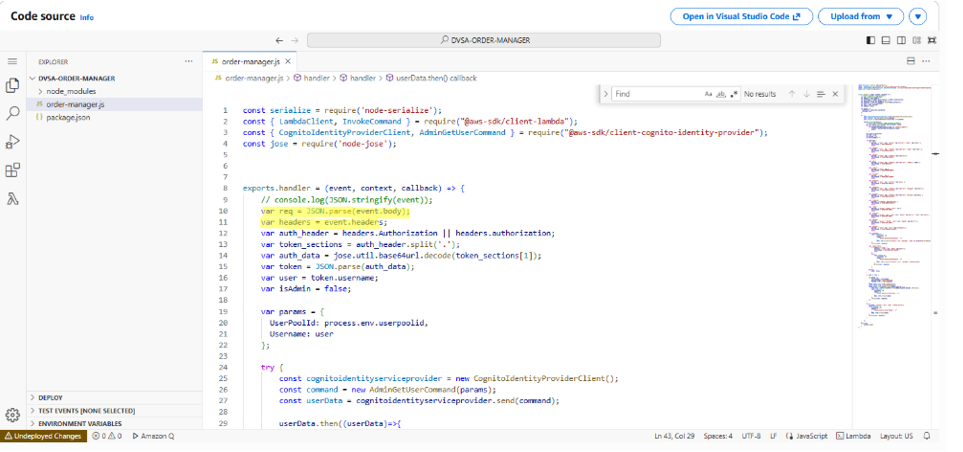
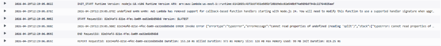

# Lesson 1 & 9: Event Injection / Vulnerable Dependencies (Remote Code Execution)

> **Lesson 1:** Event Injection  
> **Lesson 9:** Vulnerable Dependencies  
> These two lessons are covered together because they share the same exploit, root cause, evidence, and fix.

---

## How to Use This Folder

1. Start with this `README.md` to understand the vulnerability and reproduction steps.
2. Use the JSON files in `payloads/` when testing the API request.
3. Use the files in `snippets/` to compare the vulnerable code, fixed code, and validation logic.
4. Compare your results with the screenshots in the `evidence/` folder.
5. Apply the fix and repeat the verification steps to confirm that the payload no longer executes.

**Estimated time to reproduce:** 10–15 minutes if the DVSA environment, Postman, and CloudWatch access are ready.

---

## 1. Vulnerability Summary

This lesson demonstrates a **Remote Code Execution (RCE)** vulnerability in the DVSA order processing system. The vulnerability is caused by insecure deserialization using the vulnerable third-party Node.js library `node-serialize`.

By injecting a specially crafted JavaScript payload into the `action` field of an API request, an attacker can execute arbitrary code inside the AWS Lambda function. This can allow:

- Execution of attacker-controlled JavaScript inside the Lambda runtime
- File system operations such as `writeFileSync` and `readFileSync` inside `/tmp`
- Potential access to cloud resources and sensitive data available to the Lambda execution role

The affected component is the `DVSA-ORDER-MANAGER` Lambda function. The root weakness is that user input is passed into `serialize.unserialize()` from the `node-serialize` package. This library reconstructs JavaScript functions when it sees the `_$$ND_FUNC$$_` marker.

Lesson 1 focuses on the **event injection attack**. Lesson 9 focuses on the **vulnerable dependency** that makes the attack possible.

---

## 2. Root Cause

The vulnerability exists because of two combined failures:

- **Unsafe deserialization:** `node-serialize` can reconstruct JavaScript functions from serialized input and execute them when the function string ends with `()`.
- **Missing input validation:** The Lambda function passes `event.body` directly into `serialize.unserialize()` without checking the content, type, or structure first.

### Why the Attack Works

When `node-serialize` encounters the `_$$ND_FUNC$$_` prefix, it treats the value as a serialized JavaScript function. If the function ends with `()`, it is immediately invoked during deserialization. This happens before the normal application logic continues.

Because this execution happens inside AWS Lambda, the injected code runs with the same runtime access and IAM permissions as the `DVSA-ORDER-MANAGER` function.

This is also a vulnerable dependency issue. The application did not need executable deserialization for normal JSON request handling, but the dependency allowed executable content to be reconstructed from user input.

---

## 3. Environment

| Item | Value |
|---|---|
| Application | DVSA |
| AWS Region | `us-east-1` |
| API Endpoint | `POST https://<api-id>.execute-api.us-east-1.amazonaws.com/Stage/order` |
| Lambda Function | `DVSA-ORDER-MANAGER` |
| CloudWatch Log Group | `/aws/lambda/DVSA-ORDER-MANAGER` |
| AWS Services | API Gateway, AWS Lambda, CloudWatch Logs |
| Tools Used | Postman, AWS Console, CloudWatch |

**Evidence — API Gateway Invoke URL:**



---

## 4. Prerequisites

Before starting:

1. Have access to the DVSA application with a valid user account.
2. Have Postman installed.
3. Have access to AWS CloudWatch Logs in the AWS Console.
4. Know the API Gateway Invoke URL from API Gateway → Stages.
5. Prepare the payload from `payloads/rce_payload.json`.

---

## 5. Step-by-Step Reproduction

### Step 1 — Get the API Endpoint

1. Open the AWS Console.
2. Go to **API Gateway**.
3. Select the DVSA API.
4. Click **Stages** from the left menu.
5. Select the `Stage` stage.
6. Copy the **Invoke URL**.

The endpoint format is:

```text
POST https://<api-id>.execute-api.us-east-1.amazonaws.com/Stage/order
```

---

### Step 2 — Prepare the Malicious Payload

Use the payload stored in:

```text
payloads/rce_payload.json
```

Payload:

```json
{
  "action": "_$$ND_FUNC$$_function(){ var fs = require('fs'); fs.writeFileSync('/tmp/pwned.txt', 'You are reading the contents of my hacked file!'); var fileData = fs.readFileSync('/tmp/pwned.txt', 'utf-8'); console.error('FILE READ SUCCESS: ' + fileData); }()",
  "cart_id": "test"
}
```

This payload writes a file to `/tmp`, reads it back, and logs the result to CloudWatch. That proves arbitrary backend code execution.

Key parts:

- `_$$ND_FUNC$$_` tells `node-serialize` to treat the value as a function.
- `()` immediately executes the function during deserialization.
- `console.error(...)` writes proof of execution to CloudWatch Logs.

---

### Step 3 — Send the Request in Postman

**Method:** `POST`  
**URL:** `https://<api-id>.execute-api.us-east-1.amazonaws.com/Stage/order`

**Headers:**

```text
Authorization: <your_token>
Content-Type: application/json
```

**Body:** Paste the content of `payloads/rce_payload.json`.

Click **Send**.

---

### Step 4 — Observe the API Response

The API returns a generic error response:

```json
{
  "message": "Internal server error"
}
```

This error is expected. It does not mean the exploit failed. The injected code executes before the request fails.

**Evidence:**



---

### Step 5 — Verify Code Execution in CloudWatch

Open:

```text
AWS Console → CloudWatch → Log Groups → /aws/lambda/DVSA-ORDER-MANAGER
```

Open the latest log stream and search for:

```text
FILE READ SUCCESS: You are reading the contents of my hacked file!
```

This confirms that:

- The injected JavaScript executed inside Lambda.
- The payload wrote and read a file inside `/tmp`.
- The backend executed attacker-controlled code before returning the error response.

**Evidence:**


---

## 6. Attack Result Summary Before Fix

| What Was Attempted | Result |
|---|---|
| Write a file to `/tmp` inside Lambda | Succeeded |
| Read the file back | Succeeded |
| Log output to CloudWatch | Succeeded |
| API response | `500 Internal Server Error` |
| Backend code execution | Confirmed through CloudWatch |

The response looks like a normal backend failure, but CloudWatch proves that code execution happened.

---

## 7. Fix Strategy

The fix must be applied in the `DVSA-ORDER-MANAGER` Lambda function input parsing logic.

Required fixes:

- Remove `node-serialize` from request parsing.
- Replace `serialize.unserialize(event.body)` with `JSON.parse(event.body)`.
- Stop unserializing headers and use `event.headers` directly.
- Validate the `action` field before using it.
- Remove the vulnerable dependency from `package.json` if it is no longer used.
- Run dependency auditing commands regularly.

Helpful files:

```text
snippets/vulnerable_unserialize.js
snippets/fixed_json_parse.js
snippets/input_validation_snippet.js
snippets/dependency_audit_commands.md
```

---

## 8. Code / Config Changes

**Location:** `DVSA-ORDER-MANAGER` → `order-manager.js`, input parsing logic.

### Before Fix

```javascript
const serialize = require('node-serialize');
var req = serialize.unserialize(event.body);
var headers = serialize.unserialize(event.headers);
```

**Evidence — vulnerable code using `serialize.unserialize`:**


---

### After Fix

```javascript
var req = JSON.parse(event.body);
var headers = event.headers;
```

**Evidence — fixed code using `JSON.parse`:**



---

### Additional Validation

```javascript
if (typeof req.action !== 'string' || req.action.includes('_$$ND_FUNC$$_')) {
    throw new Error('Invalid action field');
}
```

This validation is defense-in-depth. The main fix is removing `node-serialize` from untrusted input handling.

---

## 9. Verification After Fix

Send the same malicious payload again using Postman:

```json
{
  "action": "_$$ND_FUNC$$_function(){ var fs = require('fs'); fs.writeFileSync('/tmp/pwned.txt', 'You are reading the contents of my hacked file!'); var fileData = fs.readFileSync('/tmp/pwned.txt', 'utf-8'); console.error('FILE READ SUCCESS: ' + fileData); }()",
  "cart_id": "test"
}
```

Then check the CloudWatch logs.

Expected result after fix:

- No `FILE READ SUCCESS` message appears.
- No file operations are performed.
- The payload is treated as text data instead of executable code.
- Normal order requests still work.

**Evidence — CloudWatch after fix shows no execution output:**



Before the fix, `node-serialize` evaluated the payload as JavaScript. After the fix, `JSON.parse()` reads the value as a normal string, so the payload does not execute.

---

## 10. Security Analysis

### Intended Logic

Normal expected flow:

```text
Browser → API Gateway → Lambda (DVSA-ORDER-MANAGER) → DynamoDB
                                                      → CloudWatch
```

Security rules:

- User input must never be executed as code.
- Request bodies must be parsed as data only.
- Third-party dependencies must not introduce unsafe execution paths.

### Table 1 — Intended vs. Observed Behavior

| Vulnerability | Intended Rule(s) | Artifacts Used | Normal Behavior Evidence | Exploit Behavior Evidence |
|---|---|---|---|---|
| Event Injection / Vulnerable Dependencies | User-controlled input must be treated as data only and must never be executed as code. | Postman request, API response, Lambda code screenshots, CloudWatch logs | Normal requests are handled as application data. | Malicious payload executed inside Lambda; CloudWatch logged `FILE READ SUCCESS`. |

### Table 2 — Deviation Analysis and Fix

| Vulnerability | Why This Is a Deviation | Deviation Class | Fix Applied | Post-Fix Verification | Latency |
|---|---|---|---|---|---|
| Event Injection / Vulnerable Dependencies | The backend deserialized user input using a dependency that can execute embedded JavaScript functions. | Intentional Misuse / Security-Relevant Abuse | Removed `node-serialize` from request parsing and replaced it with `JSON.parse()`. Added input validation. | Same payload no longer produces CloudWatch execution output. | Not measured |

---

## 11. Lessons Learned

The core mistake was using a library that can reconstruct executable JavaScript and applying it to user-controlled API input. This made a normal request field become an execution path inside the Lambda runtime.

This lesson also proves why vulnerable dependencies matter. The application code may look simple, but a dependency can introduce dangerous behavior that changes the security model completely.

In serverless applications, this is especially risky because Lambda functions often have IAM roles that can access other AWS services. A single RCE can become a larger cloud compromise if the function role is over-privileged.

The key lesson is to treat user input as untrusted data and to treat dependencies as part of the attack surface.

---

## Repository Structure

```text
lesson1_event_injection/
│
├── README.md
├── evidence/
│   ├── step1_api_gateway.png
│   ├── step4_response.png
│   ├── step5_cloudwatch.png
│   ├── vulnerable_unserialize.png
│   ├── fixed_json_parse.png
│   └── step6_fixed_logs.png
│
├── payloads/
│   ├── normal_order_request.json
│   ├── postman_request_template.json
│   └── rce_payload.json
│
└── snippets/
    ├── dependency_audit_commands.md
    ├── fixed_json_parse.js
    ├── input_validation_snippet.js
    └── vulnerable_unserialize.js
```
