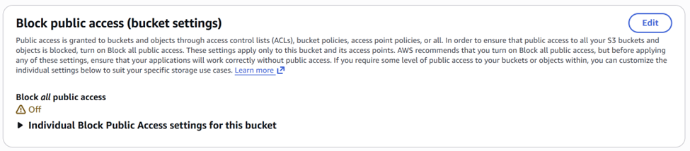
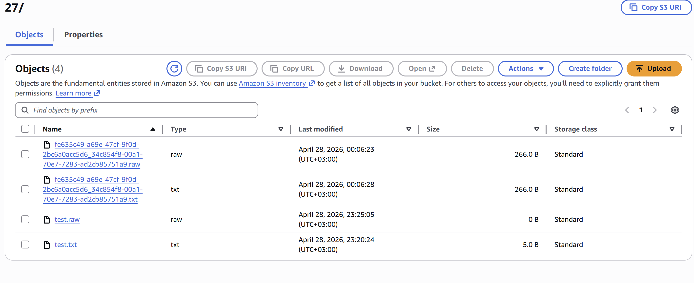
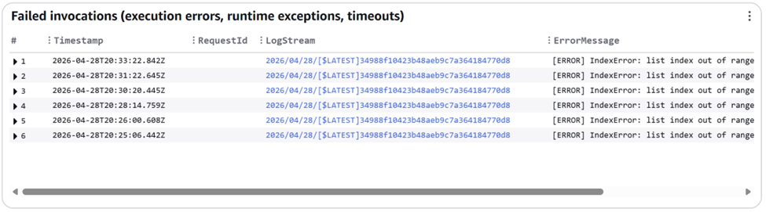
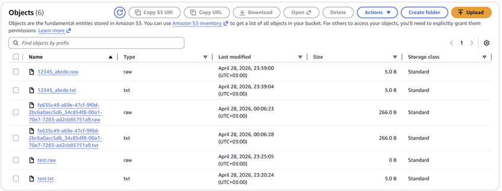
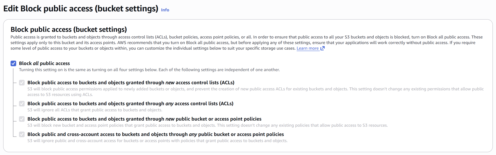
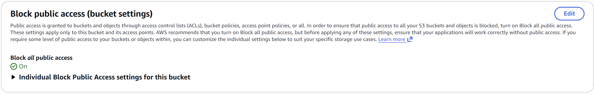
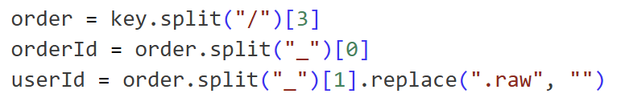
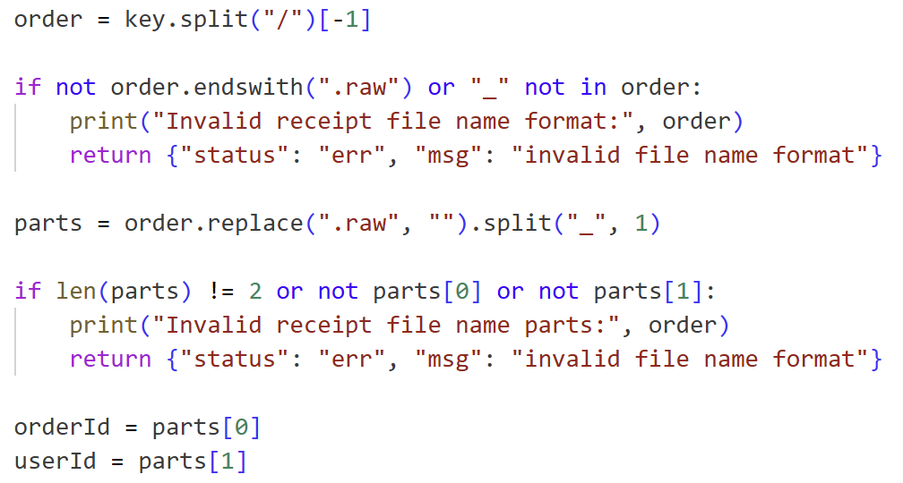
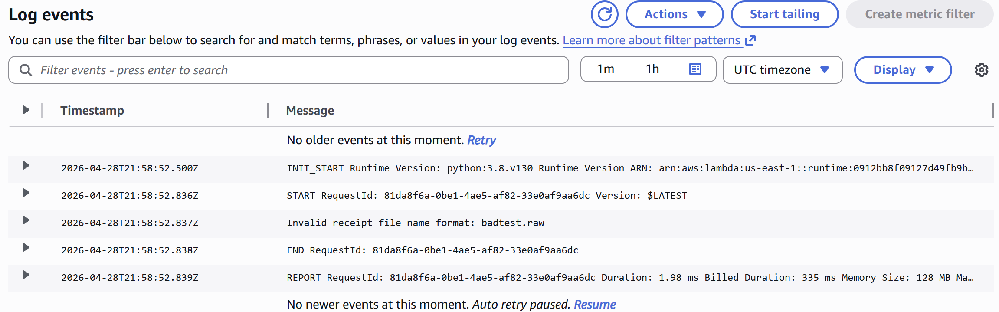
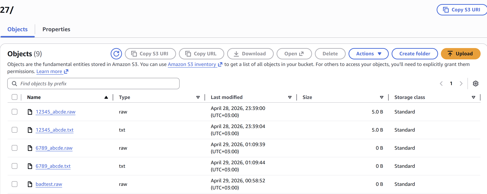

# Lesson 4: Insecure Cloud Configuration

## How to Use This Folder

1. Read this README from top to bottom.
2. Follow the reproduction steps in Section 5.
3. Compare your results with the screenshots in the `evidence/` folder.
4. Apply the fix shown in Section 8.
5. Repeat the verification steps in Section 9 to confirm the vulnerability is removed.

> **Important:** Perform these steps only in the authorized DVSA lab environment or another environment where you have permission to test.

---

## 1. Vulnerability Summary

This lesson demonstrates an **Insecure Cloud Configuration** vulnerability in an AWS S3 bucket used by the DVSA application.

The S3 bucket was configured with public access controls not fully blocking public access. Because of this, unauthorized or unintended users could upload arbitrary files to the bucket. These uploaded files were then automatically processed by a backend Lambda function, creating a security risk because attacker-controlled input could trigger backend behavior.

The affected components are:

- S3 bucket: `dvsa-recipts-bucket`
- Lambda function: `DVSA-SEND-RECEIPT-EMAIL`
- CloudWatch log group for Lambda execution logs

The main impact is that arbitrary uploaded files can cause the backend Lambda function to run on attacker-controlled input. When the uploaded filename does not match the expected format, the function crashes with an `IndexError`, showing that the backend does not safely validate file names before processing them.

---

## 2. Root Cause

The vulnerability exists because of two combined failures:

- **Insecure S3 bucket permissions** — the S3 bucket did not properly block public access, allowing files to be uploaded when they should not be accepted from untrusted sources.
- **Missing filename validation in Lambda** — the Lambda function assumed that every uploaded file followed the expected `orderId_userId.raw` format and directly split the filename without checking if the required parts existed.

### Why the attack works

The S3 bucket is connected to a backend processing flow. When a file is uploaded, the `DVSA-SEND-RECEIPT-EMAIL` Lambda function is triggered and attempts to parse the uploaded object key.

The vulnerable code expects a filename like:

```text
12345_abcde.raw
```

However, when a file like this is uploaded:

```text
test.raw
```

there is no underscore (`_`) separating `orderId` and `userId`. The function still tries to access the second split value, causing:

```text
IndexError: list index out of range
```

This proves that the backend is processing untrusted uploaded files without validating the filename format first.

---

## 3. Environment

| Item | Value |
|---|---|
| Application | DVSA |
| AWS Region | `us-east-1` |
| S3 Bucket | `dvsa-recipts-bucket` |
| Lambda Function | `DVSA-SEND-RECEIPT-EMAIL` |
| CloudWatch Log Group | Lambda execution logs for `DVSA-SEND-RECEIPT-EMAIL` |
| AWS Services | Amazon S3, AWS Lambda, Amazon CloudWatch |
| Tools Used | AWS Management Console |

**Evidence — S3 bucket permissions before the fix:**



---

## 4. Prerequisites

Before starting:

1. Have access to the DVSA lab AWS account.
2. Have permission to view and edit the S3 bucket configuration.
3. Have permission to upload test files to the S3 bucket.
4. Have permission to view the Lambda function and CloudWatch logs.
5. Know the target S3 bucket name: `dvsa-recipts-bucket`.

**Estimated time to reproduce:** 10-15 minutes if the DVSA environment is already deployed.

No helper script was required for this lesson because the vulnerability was reproduced manually using the AWS Management Console, S3, Lambda, and CloudWatch.

---

## 5. Step-by-Step Reproduction

### Step 1: Identify the S3 Bucket

1. Go to the AWS Console.
2. Open **S3**.
3. Search for the bucket named `dvsa-recipts-bucket`.
4. Open the bucket and confirm it is used for receipt files.

---

### Step 2: Verify the Bucket Misconfiguration

1. Open the S3 bucket.
2. Go to the **Permissions** tab.
3. Check the **Block public access** section.
4. Confirm that **Block all public access** is not enabled.

This indicates that the bucket is not locked down as expected and may allow unauthorized or unintended uploads.

**Evidence:**


---

### Step 3: Upload an Arbitrary Test File

Create a file named:

```text
test.raw
```

Upload it to this path inside the S3 bucket:

```text
2026/04/27/test.raw
```

This file does not follow the expected `orderId_userId.raw` naming format.

---

### Step 4: Observe the Failure Case

After uploading `test.raw`, check the same S3 location.

**Expected vulnerable behavior:**

- The uploaded file appears in the bucket.
- No corresponding `.txt` output file is generated.
- The backend Lambda function fails because the filename does not match the expected format.

**Evidence:**



---

### Step 5: Check CloudWatch Logs

Go to:

**AWS Console → CloudWatch → Log groups → Lambda logs for `DVSA-SEND-RECEIPT-EMAIL`**

Open the latest log stream and look for an error similar to:

```text
IndexError: list index out of range
```

This confirms that the Lambda function attempted to process the uploaded file and crashed because it did not validate the filename structure.

**Evidence:**



---

### Step 6: Upload a Valid Pattern File

Create and upload another file named:

```text
12345_abcde.raw
```

Upload it to the same S3 path:

```text
2026/04/27/12345_abcde.raw
```

This file follows the expected naming format.

---

### Step 7: Observe Successful Processing

After uploading the correctly formatted file, return to the S3 bucket path.

**Expected vulnerable behavior:**

- The `.raw` file appears in the bucket.
- A corresponding `.txt` file is generated automatically.
- This confirms that the Lambda function processes uploaded files based on filename format.

**Evidence:**



---

## 6. Attack Result Summary (Before Fix)

| What was attempted | Result |
|---|---|
| Upload malformed file `test.raw` | Succeeded |
| Trigger backend Lambda processing | Succeeded |
| Generate output `.txt` file from malformed input | Failed |
| Lambda runtime behavior | Crashed with `IndexError` |
| Upload valid file `12345_abcde.raw` | Succeeded |
| Generate output `.txt` file from valid input | Succeeded |

The insecure bucket configuration allowed an arbitrary file to reach backend processing. The Lambda function then failed because it assumed every filename followed the correct format.

---

## 7. Fix Strategy

The fix should be applied in two places: the S3 bucket configuration and the Lambda processing logic.

- **Enable S3 Block Public Access** — prevent public or unintended uploads to the receipt bucket.
- **Restrict write permissions** — allow only trusted services or authenticated users to upload receipt files.
- **Validate filename format** — reject any file that does not match the expected `orderId_userId.raw` pattern.
- **Handle errors safely** — invalid files should be logged and rejected instead of causing runtime crashes.
- **Apply least privilege** — the bucket and Lambda role should only have the permissions required for this workflow.

---

## 8. Code / Config Changes

### Config Change 1: Secure the S3 Bucket

**Location:** S3 bucket `dvsa-recipts-bucket` → **Permissions** → **Block public access**

**Before:**

The bucket did not have **Block all public access** enabled.


**Change applied:**

```text
S3 Bucket → Permissions → Block public access → Edit
Enabled: Block all public access
```

**Evidence — editing the S3 block public access setting:**



**After:**

The bucket shows **Block all public access** enabled.



---

### Code Change 2: Validate Uploaded Filename Format

**Location:** Lambda function `DVSA-SEND-RECEIPT-EMAIL`, receipt filename parsing logic

**Before (vulnerable):**

```python
order = key.split("/")[3]
orderId = order.split("_")[0]
userId = order.split("_")[1].replace(".raw", "")
```

The code assumes that the S3 object key always contains the expected folder structure and that the filename always contains an underscore. If either assumption is false, the Lambda function can crash.

**Evidence — vulnerable filename parsing:**



**After (fixed):**

```python
order = key.split("/")[-1]

if not order.endswith(".raw") or "_" not in order:
    print("Invalid receipt file name format:", order)
    return {"status": "err", "msg": "invalid file name format"}

parts = order.replace(".raw", "").split("_", 1)

if len(parts) != 2 or not parts[0] or not parts[1]:
    print("Invalid receipt file name parts:", order)
    return {"status": "err", "msg": "invalid file name format"}

orderId = parts[0]
userId = parts[1]
```

**Evidence — fixed filename validation:**



**Summary of all changes:**

- Enabled **Block all public access** on the S3 bucket.
- Replaced unsafe positional path parsing with safer filename extraction using `key.split("/")[-1]`.
- Added validation for the `.raw` extension.
- Added validation that the filename contains the required underscore separator.
- Added validation that both `orderId` and `userId` are present.
- Invalid filenames now return a safe error message instead of crashing the Lambda function.

---

## 9. Verification After Fix

After applying the fixes, repeat the tests using authorized AWS console access.

### Test 1: Verify Invalid Filename Is Rejected Safely

Upload an invalid file named:

```text
badtest.raw
```

**Expected result after fix:**

- The Lambda function does not crash.
- CloudWatch logs show a safe validation message.
- No `IndexError` appears.
- The system rejects the malformed filename safely.

**Evidence — CloudWatch after fix:**



---

### Test 2: Verify Normal Functionality Still Works

Upload a correctly formatted file, for example:

```text
6789_abcde.raw
```

**Expected result after fix:**

- The file is processed normally.
- The corresponding `.txt` output file is generated.
- The fix does not break legitimate receipt processing.

**Evidence — valid file still processed after fix:**



---

## 10. Security Analysis

### Intended Logic

Under normal conditions, receipt files should be uploaded only by trusted application components or authorized users. The expected flow is:

```text
Authorized receipt upload → S3 bucket → Lambda (DVSA-SEND-RECEIPT-EMAIL) → generated receipt output / email processing
```

**Security rules the system must enforce:**

- S3 should not accept public or untrusted uploads.
- Uploaded files must be validated before backend processing.
- Backend code must not assume user-controlled filenames are safe.
- Malformed input should be rejected without causing runtime crashes.

---

### Table 1 — Intended vs. Observed Behavior

| Vulnerability | Intended Rule(s) | Artifacts Used | Normal Behavior Evidence | Exploit Behavior Evidence |
|---|---|---|---|---|
| Insecure Cloud Configuration | Only authorized and validated files should be uploaded and processed. The system should not allow arbitrary user-controlled input to trigger backend processing. | S3 bucket permissions, Lambda code, S3 object results, CloudWatch logs | Valid file `12345_abcde.raw` is processed correctly and a corresponding `.txt` file is generated (`04_valid_pattern_file_processed.png`) | Arbitrary file `test.raw` was accepted and triggered Lambda execution. CloudWatch showed `IndexError`, proving malformed input was processed without validation (`02_uploaded_test_raw_failure.png`, `03_cloudwatch_index_error.png`) |

---

### Table 2 — Deviation Analysis and Fix

| Vulnerability | Why This Is a Deviation | Deviation Class | Fix Applied | Post-Fix Verification | Latency |
|---|---|---|---|---|---|
| Insecure Cloud Configuration | The system allowed arbitrary uploads and processed them without validating filename format, violating the rule that only authorized and properly formatted input should be accepted. | Accidental Misconfiguration / Security-Relevant Abuse | Enabled S3 **Block all public access**; restricted upload path to authorized use; added filename validation in `DVSA-SEND-RECEIPT-EMAIL` | Invalid file `badtest.raw` is rejected safely without crashing; valid file `6789_abcde.raw` is still processed successfully | Not measured |

---

## 11. Lessons Learned

This lesson shows how cloud misconfiguration can become a real application vulnerability when it is connected to backend automation. A public or weakly restricted S3 bucket is not only a storage issue; it can also become an entry point into backend processing if object uploads automatically trigger Lambda functions.

The second issue was the Lambda function's trust in the uploaded filename. The function assumed every file would follow the expected `orderId_userId.raw` format, but attackers can upload malformed names. Without validation, even a simple filename can break the function and expose unstable backend behavior.

The main takeaway is that cloud security requires both **secure service configuration** and **safe application logic**. S3 buckets should block public access unless there is a clear reason not to, IAM permissions should follow least privilege, and Lambda functions should validate all event data before using it.

---


## Repository Structure

```text
lesson4_insecure_cloud_configuration/
│
├── README.md
└── evidence/
    ├── 01_s3_public_access_disabled.png
    ├── 02_uploaded_test_raw_failure.png
    ├── 03_cloudwatch_index_error.png
    ├── 04_valid_pattern_file_processed.png
    ├── 05_vulnerable_lambda_filename_parsing.png
    ├── 06_enable_block_public_access_edit.png
    ├── 07_s3_public_access_enabled_after_fix.png
    ├── 08_before_code_zoomed.png
    ├── 09_fixed_lambda_filename_validation.png
    ├── 10_cloudwatch_invalid_filename_after_fix.png
    └── 11_valid_file_processed_after_fix.png
```
