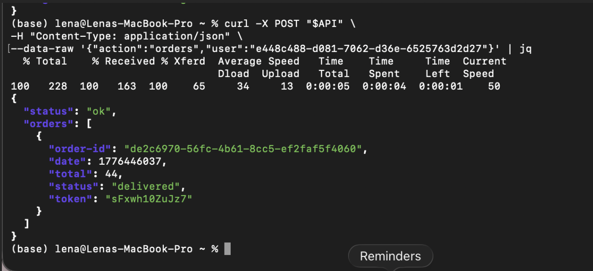
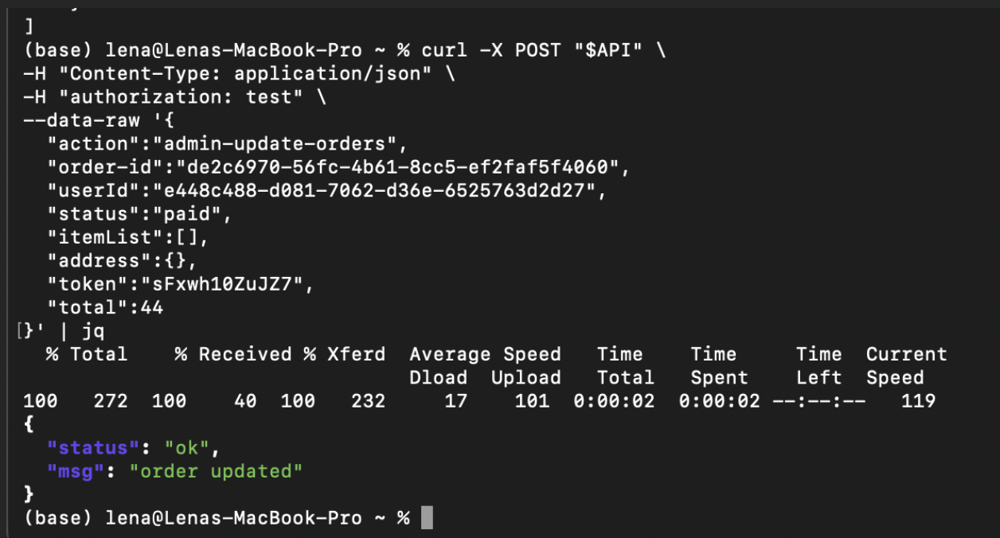
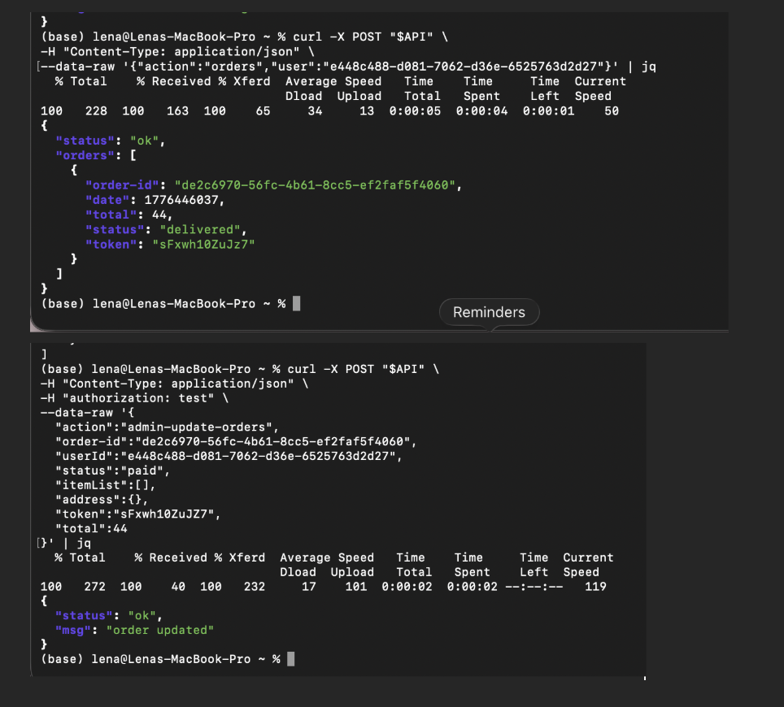
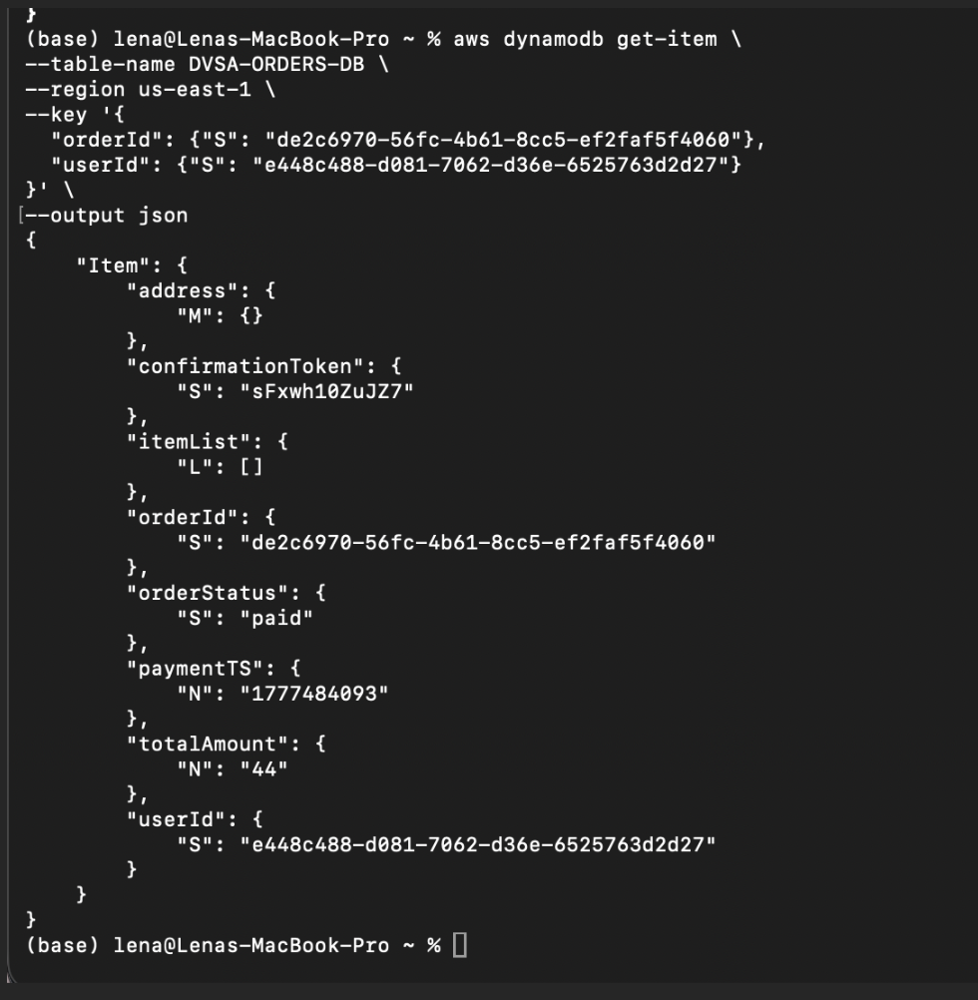
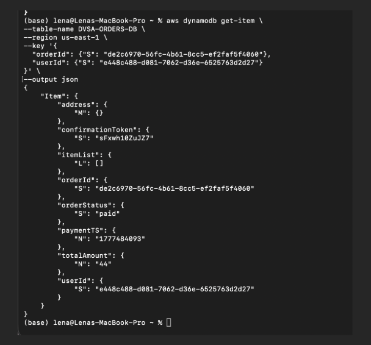
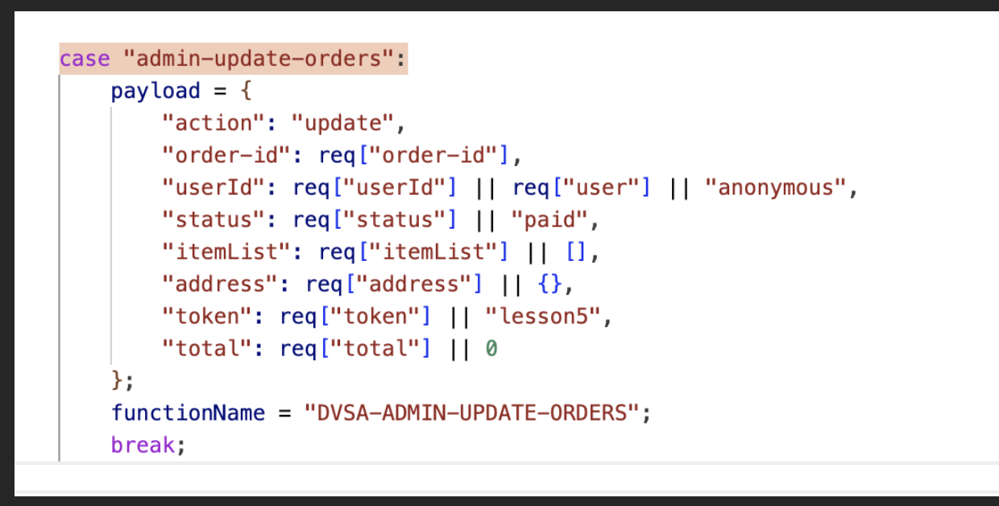
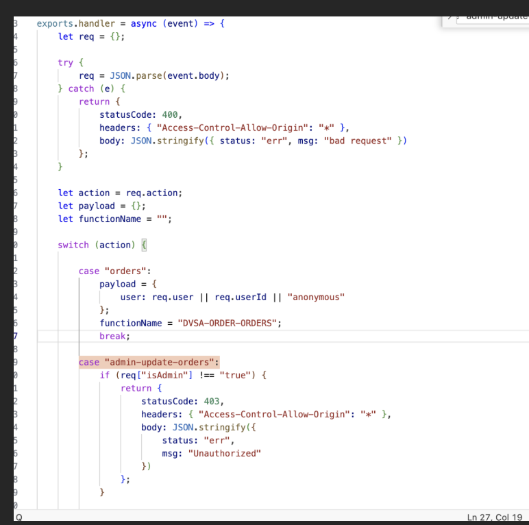
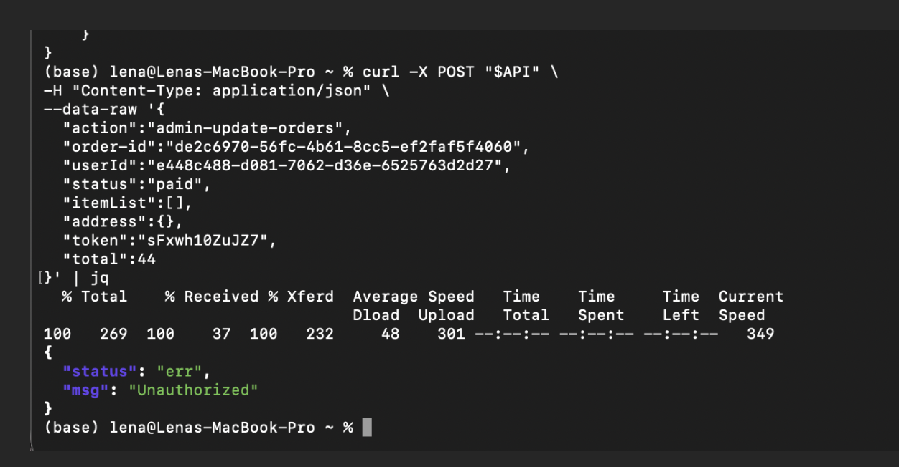

# Lesson 5: Broken Access Control

## How to Use This Folder

1. Read this README from top to bottom.
2. Follow the reproduction steps in Section 5.
3. Compare your results with the screenshots in the `evidence/` folder.
4. Use the example JSON files in `payloads/` to avoid rewriting request bodies manually.
5. Review the vulnerable and fixed code examples in `snippets/`.
6. Apply the authorization fix shown in Section 8.
7. Repeat the verification steps in Section 9 to confirm the vulnerability is removed.

---

## 1. Vulnerability Summary

This lesson demonstrates a **Broken Access Control** vulnerability in the DVSA order workflow.

A normal authenticated user was able to call the administrative action `admin-update-orders` and change an order status to `paid` without administrator privileges and without completing the normal payment workflow.

The affected components are:

- API Gateway order endpoint
- Lambda order manager logic
- Administrative Lambda function: `DVSA-ADMIN-UPDATE-ORDERS`
- DynamoDB table: `DVSA-ORDERS-DB`

The main impact is that an unprivileged user can bypass the billing process and make an order appear as paid. This is a serious authorization failure because payment status is sensitive business data and should only be changed by a trusted payment flow or a privileged administrative role.

---

## 2. Root Cause

The vulnerability exists because the backend does not properly enforce authorization before running a sensitive administrative update.

The public order API accepts an action value from the request body. When the action is set to:

```text
admin-update-orders
```

the backend reaches the administrative update logic and prepares a payload for `DVSA-ADMIN-UPDATE-ORDERS`. In the vulnerable version, this happens without first verifying that the caller is an administrator.

### Why the attack works

The application checks that the user is authenticated, but authentication alone only proves that the user is logged in. It does not prove that the user is allowed to perform administrative actions.

Because the backend does not check the caller role before invoking the privileged update path, a normal user can send a crafted request and force the backend to update the order status in DynamoDB.

The vulnerable behavior is caused by three issues:

- **Missing admin authorization check** before the administrative order update.
- **Administrative action exposed through a public API path** used by normal users.
- **No protected order-state validation** to confirm that `paid` status came from a legitimate payment workflow.

---

## 3. Environment

| Item | Value |
|---|---|
| Application | DVSA |
| AWS Region | `us-east-1` |
| API Endpoint | `POST https://d0xsecb8a2.execute-api.us-east-1.amazonaws.com/dvsa/order` |
| Lambda Function | `DVSA-ORDER-MANAGER` |
| Privileged Function | `DVSA-ADMIN-UPDATE-ORDERS` |
| Database | `DVSA-ORDERS-DB` |
| AWS Services | API Gateway, AWS Lambda, Amazon DynamoDB |
| Tools Used | Browser DevTools, Terminal, `curl`, `jq`, AWS CLI, AWS Console, optional Python helper script |

**Evidence — normal order state before exploitation:**

<p align="center">
  
  <br>
  <em>Figure 1 — Normal user retrieves an existing order before exploitation. The order status is shown as delivered.</em>
</p>

---

## 4. Prerequisites

Before starting:

1. Have access to the authorized DVSA lab environment.
2. Have a normal authenticated user account, not an admin account.
3. Have access to Browser DevTools to capture the normal user authorization token.
4. Have `curl` installed.
5. Have `jq` installed for readable JSON output.
6. Have AWS CLI or AWS Console access to verify the order record in DynamoDB.
7. Know the target order ID and user ID used for the test.

**Estimated time to reproduce:** 10-15 minutes if the DVSA environment is already deployed.

A helper script is included as `access_control_test.py`. The script is sanitized and uses a placeholder token so no real authorization token is committed to the repository.

To use the helper script:

```bash
pip install -r
python3 access_control_test.py
```

Before running the script, replace this value inside `access_control_test.py`:

```python
AUTH_TOKEN = "PASTE_NORMAL_USER_TOKEN_HERE"
```

---

## 5. Step-by-Step Reproduction

### Step 1: Login Using a Normal User Account

Login to the DVSA application using a normal user account.

This account represents an unprivileged customer user. It should be allowed to view and manage its own order flow, but it should not be allowed to trigger administrative order updates.

---

### Step 2: Capture the Authorization Token

1. Open the browser Developer Tools.
2. Go to the **Network** tab.
3. Perform an order-related action.
4. Find the request sent to the order API endpoint.
5. Copy the normal user `Authorization` header value.

Use this token only in the authorized lab environment. Do not commit real tokens to GitHub.

---

### Step 3: Set the API Endpoint

In the terminal, set the API endpoint variable:

```bash
export API="https://d0xsecb8a2.execute-api.us-east-1.amazonaws.com/dvsa/order"
export AUTH="<normal_user_token>"
```

The same commands are also available in:

```text
snippets/curl_reproduction_commands.sh
```

---

### Step 4: Verify the Existing Order State

Before exploiting the issue, send a normal request to retrieve the user orders.

Request body file:

```text
payloads/check_orders_payload.json
```

Command:

```bash
curl -X POST "$API" \
  -H "Content-Type: application/json" \
  -H "authorization: $AUTH" \
  --data @payloads/check_orders_payload.json | jq
```

Expected result before exploitation:

- The API returns `status: ok`.
- The order exists.
- The order status is `delivered`.
- The order has a total amount of `44`.

**Evidence:**

<p align="center">
  
  <br>
  <em>Figure 2 — The normal order query confirms that the order exists before the exploit.</em>
</p>

---

### Step 5: Execute the Broken Access Control Exploit

Send a crafted request using the administrative action `admin-update-orders`.

Request body file:

```text
payloads/admin_update_exploit_payload.json
```

Command:

```bash
curl -X POST "$API" \
  -H "Content-Type: application/json" \
  -H "authorization: $AUTH" \
  --data @payloads/admin_update_exploit_payload.json | jq
```

Expected vulnerable result:

```json
{
  "status": "ok",
  "msg": "order updated"
}
```

This response shows that the normal user request reached the privileged update operation.

**Evidence:**

<p align="center">
  
  <br>
  <em>Figure 3 — A normal user sends the administrative update request and receives order updated.</em>
</p>

**Evidence — combined before/exploit view:**

<p align="center">
  
  <br>
  <em>Figure 4 — Normal order retrieval and administrative update evidence shown together.</em>
</p>

---

### Step 6: Verify the Change in DynamoDB

After sending the crafted request, verify the order record directly in DynamoDB.

DynamoDB key file:

```text
payloads/dynamodb_get_item_key.json
```

Command:

```bash
aws dynamodb get-item \
  --table-name DVSA-ORDERS-DB \
  --region us-east-1 \
  --key file://payloads/dynamodb_get_item_key.json \
  --output json
```

Expected vulnerable result:

```text
orderStatus = paid
```

This confirms that the payment state was changed in the backend database without the normal payment workflow.

**Evidence:**

<p align="center">
  
  <br>
  <em>Figure 5 — DynamoDB confirms that the orderStatus field changed to paid.</em>
</p>

**Evidence — DynamoDB result zoomed:**

<p align="center">
  
  <br>
  <em>Figure 6 — Zoomed DynamoDB output showing the paid order status.</em>
</p>

---

## 6. Attack Result Summary (Before Fix)

| What was attempted | Result |
|---|---|
| Query existing orders as a normal user | Succeeded |
| Call `admin-update-orders` as a normal user | Succeeded |
| Update order status to `paid` | Succeeded |
| Verify status in DynamoDB | Confirmed — `orderStatus` became `paid` |
| Administrator privileges required | Not enforced |

The exploit shows that the application trusted the request action instead of enforcing server-side authorization. The API response and DynamoDB record both confirm that a normal user reached privileged backend functionality.

---

## 7. Fix Strategy

The fix must ensure that normal users cannot reach administrative backend functions.

Recommended mitigation:

- **Enforce role-based access control** before processing `admin-update-orders`.
- **Validate the caller role on the server side**, using trusted identity claims or a trusted authorization context.
- **Reject non-admin users with `403 Unauthorized`** before invoking `DVSA-ADMIN-UPDATE-ORDERS`.
- **Separate administrative actions from customer-facing API paths** where possible.
- **Validate order state transitions**, so `paid` can only be set after the payment workflow succeeds or by an authorized administrator.
- **Avoid trusting request-body fields for privilege decisions** in real deployments.

---

## 8. Code / Config Changes

**Location:** Lambda function `DVSA-ORDER-MANAGER`, action routing logic for `admin-update-orders`

### Before (vulnerable)

The vulnerable code builds the administrative update payload and sets the privileged function name without first checking whether the caller is an administrator.

The full code snippet is stored in:

```text
snippets/vulnerable_admin_update_code.js
```

```javascript
case "admin-update-orders":
    payload = {
        "action": "update",
        "order-id": req["order-id"],
        "userId": req["userId"] || req["user"] || "anonymous",
        "status": req["status"] || "paid",
        "itemList": req["itemList"] || [],
        "address": req["address"] || {},
        "token": req["token"] || "lesson5",
        "total": req["total"] || 0
    };
    functionName = "DVSA-ADMIN-UPDATE-ORDERS";
    break;
```

**Evidence — vulnerable administrative update code:**

<p align="center">
  
  <br>
  <em>Figure 7 — The admin-update-orders case reaches DVSA-ADMIN-UPDATE-ORDERS without an admin check.</em>
</p>

---

### After (fixed)

An authorization check was added before constructing the administrative payload and before invoking `DVSA-ADMIN-UPDATE-ORDERS`.

The full code snippet is stored in:

```text
snippets/fixed_admin_authorization_check.js
```

```javascript
case "admin-update-orders":
    if (req["isAdmin"] !== "true") {
        return {
            statusCode: 403,
            headers: { "Access-Control-Allow-Origin": "*" },
            body: JSON.stringify({
                status: "err",
                msg: "Unauthorized"
            })
        };
    }

    payload = {
        "action": "update",
        "order-id": req["order-id"],
        "userId": req["userId"] || req["user"] || "anonymous",
        "status": req["status"] || "paid",
        "itemList": req["itemList"] || [],
        "address": req["address"] || {},
        "token": req["token"] || "lesson5",
        "total": req["total"] || 0
    };
    functionName = "DVSA-ADMIN-UPDATE-ORDERS";
    break;
```

**Important security note:** For the lab demonstration, the screenshot shows a simple admin validation check. In a production system, the admin role should come from a trusted source such as verified identity claims or server-side authorization context, not from a user-controlled request body field.

**Evidence — fixed authorization check:**

<p align="center">
  
  <br>
  <em>Figure 8 — The fixed code rejects non-admin requests before reaching the privileged update function.</em>
</p>

**Summary of all changes:**

- Added an authorization check before the `admin-update-orders` logic.
- Returned `403 Unauthorized` for non-admin requests.
- Stopped the request before it could invoke `DVSA-ADMIN-UPDATE-ORDERS`.
- Preserved the admin update flow only for authorized administrators.
- Recommended trusted role validation for production-quality authorization.

---

## 9. Verification After Fix

After applying the fix, repeat the same malicious request using the normal user context.

Request body file:

```text
payloads/post_fix_verification_payload.json
```

Command:

```bash
curl -X POST "$API" \
  -H "Content-Type: application/json" \
  -H "authorization: $AUTH" \
  --data @payloads/post_fix_verification_payload.json | jq
```

Expected result after fix:

```json
{
  "status": "err",
  "msg": "Unauthorized"
}
```

This confirms that normal users can no longer directly call the administrative order update path.

**Evidence — same request rejected after fix:**

<p align="center">
  
  <br>
  <em>Figure 9 — After the fix, the same request returns Unauthorized instead of order updated.</em>
</p>

**What changed:** Before the fix, the backend allowed the normal user request to reach `DVSA-ADMIN-UPDATE-ORDERS`. After the fix, the request is stopped inside `DVSA-ORDER-MANAGER` and returns a safe authorization error.

---

## 10. Security Analysis

### Intended Logic

Under normal conditions, a customer should not directly update payment state. The expected order flow is:

```text
Customer order request → API Gateway → DVSA-ORDER-MANAGER → legitimate order/payment workflow → DynamoDB update
```

Administrative updates should follow a separate protected flow:

```text
Authorized admin request → protected admin path → authorization check → DVSA-ADMIN-UPDATE-ORDERS → DynamoDB update
```

**Security rules the system must enforce:**

- A logged-in user is not automatically an administrator.
- Only administrators should reach `DVSA-ADMIN-UPDATE-ORDERS`.
- Payment status must not be changed directly by normal users.
- Sensitive state transitions must be validated on the server side.
- The backend must not trust user-supplied action values for privilege decisions.

---

### Table 1 — Intended vs. Observed Behavior

| Vulnerability | Intended Rule(s) | Artifacts Used | Normal Behavior Evidence | Exploit Behavior Evidence |
|---|---|---|---|---|
| Broken Access Control | Only privileged administrative functions should update order payment status. Normal users must not access `DVSA-ADMIN-UPDATE-ORDERS` directly. | API requests, Lambda routing code, DynamoDB record, terminal output, authorization token context | Normal user can retrieve existing order information through the expected `orders` action (`01_normal_order_before_exploit.png`) | Normal user calls `admin-update-orders`, receives `order updated`, and DynamoDB confirms `orderStatus` changed to `paid` (`02_admin_update_success_response.png`, `03_dynamodb_order_status_paid.png`) |

---

### Table 2 — Deviation Analysis and Fix

| Vulnerability | Why This Is a Deviation | Deviation Class | Fix Applied | Post-Fix Verification | Latency |
|---|---|---|---|---|---|
| Broken Access Control | The system allowed a normal authenticated user to perform privileged backend actions that should only be available to administrators. This violated the intended rule that payment-related state changes require authorized administrative or payment workflow control. | Missing Authorization / Security-Relevant Abuse | Added an authorization check inside `DVSA-ORDER-MANAGER` before invoking `DVSA-ADMIN-UPDATE-ORDERS` | Repeating the same request returns `Unauthorized`; the privileged function is no longer reachable by a normal user (`08_post_fix_unauthorized_response.png`) | Not measured |

---

## 11. Lessons Learned

This lesson shows that authentication and authorization are not the same. A user may be logged in, but that does not mean the user is allowed to perform administrative operations.

The core issue was that the public order API trusted the requested action and allowed a normal user to trigger `admin-update-orders`. This gave the user access to sensitive backend behavior that should have been restricted to administrators only.

The most important takeaway is that access control must be enforced on the server side before any privileged action is executed. Administrative functions should not be reachable through normal user workflows unless the backend verifies a trusted admin role first.

Sensitive order-state changes, especially changes to `paid`, must be protected by secure business logic. A normal user should never be able to change payment status by sending a direct API request.

---

## Repository Structure

```text
lesson5_broken_access_control/
│
├── README.md
├── access_control_test.py
├── evidence/
│   ├── 00_evidence_contact_sheet.png
│   ├── 01_normal_order_before_exploit.png
│   ├── 02_admin_update_success_response.png
│   ├── 03_dynamodb_order_status_paid.png
│   ├── 04_combined_before_and_exploit_api.png
│   ├── 05_dynamodb_paid_zoomed.png
│   ├── 06_vulnerable_admin_update_code.png
│   ├── 07_fixed_admin_authorization_check.png
│   └── 08_post_fix_unauthorized_response.png
├── payloads/
│   ├── check_orders_payload.json
│   ├── admin_update_exploit_payload.json
│   ├── post_fix_verification_payload.json
│   └── dynamodb_get_item_key.json
└── snippets/
    ├── vulnerable_admin_update_code.js
    ├── fixed_admin_authorization_check.js
    ├── curl_reproduction_commands.sh
    └── dynamodb_verify_command.sh
```
