# Lesson 7: Over-Privileged Functions

## How to Use This Folder

1. Read this README from top to bottom.
2. Follow the reproduction steps in Section 5.
3. Compare your results with the screenshots in the `evidence/` folder.
4. Apply the IAM policy changes shown in Section 8.
5. Repeat the verification steps in Section 9 to confirm the role is restricted correctly.

No helper script was required for this lesson because the work was performed using the AWS Management Console, IAM Policy Simulator, CloudTrail, CloudWatch, and AWS CLI.
The `payloads/` folder contains the least-privilege IAM policy JSON files, and the `snippets/` folder contains the commands, simulator test cases, and cleanup checklist used for the lesson.


---
## Demo Link
https://youtu.be/i75R_j3mBg4

## 1. Vulnerability Summary

This lesson demonstrates an **Over-Privileged Function** vulnerability in the DVSA serverless application.

The affected component is the `DVSA-SEND-RECEIPT-EMAIL` Lambda function. This function only needs limited permissions to support the receipt-email workflow, such as reading or writing receipt files and sending email. However, its execution role was configured with broad wildcard permissions across S3, DynamoDB, and SES.

If this Lambda function is compromised through any code bug, vulnerable dependency, malicious event payload, or temporary credential exposure, an attacker can inherit the same permissions as the function role. This expands the blast radius from one function to unrelated AWS resources.

The impact includes:

- Access to receipt files beyond the minimum needed scope
- Ability to read or modify DynamoDB data outside the normal receipt workflow
- Ability to use broad SES permissions instead of only email-sending permissions
- Larger account-level impact if the Lambda function is compromised

---

## 2. Root Cause

The root cause is a failure to apply the **Principle of Least Privilege**.

AWS Lambda code runs using its configured IAM execution role. Any code running inside the function can use the temporary AWS credentials provided to that role. If the role has broad permissions, then any compromised code path inside the function can perform those broad actions.

The issue is not mainly the function logic itself. The issue is that the role permissions were too wide for the function's actual job.

Main causes:

- S3 permissions were granted on wildcard resources instead of only the receipts bucket.
- DynamoDB permissions were granted broadly across tables instead of only the required DVSA tables.
- `AmazonSESFullAccess` was attached even though the function only needed to send emails.
- An invalid STS policy existed with a misspelled action, showing weak policy review.
- The role had not been reduced based on actual CloudTrail-observed usage.

---

## 3. Environment

| Item | Value |
|---|---|
| Application | DVSA |
| AWS Region | `us-east-1` |
| AWS Account | `716563790099` |
| Lambda Function | `DVSA-SEND-RECEIPT-EMAIL` |
| Execution Role | `serverlessrepo-OWASP-DVSA-SendReceiptFunctionRole-VciesI84W3Jt` |
| CloudTrail Trail | `dvsa-policygen-trail` |
| Main Services | AWS Lambda, IAM, S3, DynamoDB, SES, CloudTrail, CloudWatch |
| Tools Used | AWS Console, IAM Policy Simulator, CloudTrail, CloudWatch Logs, AWS CLI, PowerShell |

**Evidence - AWS CLI setup and identity verification:**

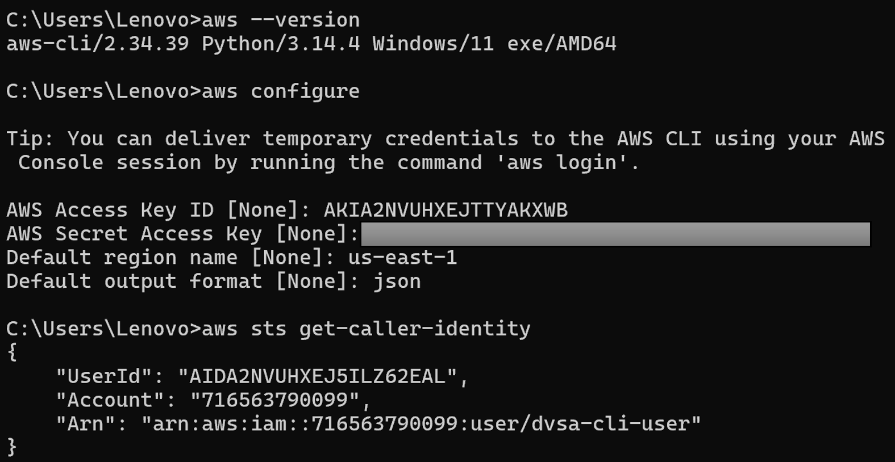

---

## 4. Prerequisites

Before starting:

1. Have access to the deployed DVSA AWS environment.
2. Have permission to view Lambda, IAM, CloudTrail, CloudWatch, S3, DynamoDB, and SES.
3. Have AWS CLI configured for the account.
4. Use a controlled lab environment only.
5. Do not leave temporary credential-printing code inside Lambda after collecting evidence.

**Estimated time to reproduce:** 25-40 minutes, depending on CloudTrail policy generation time.

---

## 5. Step-by-Step Reproduction

### Phase A: Inspect the Lambda Execution Role

1. Open the AWS Console.
2. Go to **Lambda → Functions**.
3. Select `DVSA-SEND-RECEIPT-EMAIL`.
4. Open **Configuration → Permissions**.
5. Click the execution role link to open it in IAM.
6. Review the attached policies and look for broad actions, wildcard resources, and managed policies that grant more access than the function needs.

**Evidence - Lambda function execution role:**

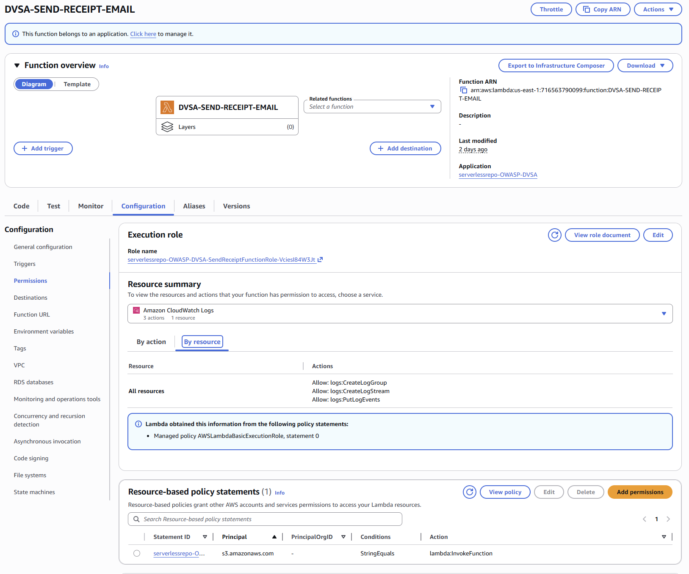

**Evidence - Attached policies on the role:**

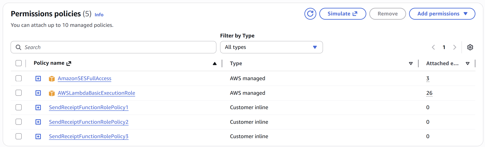

---

### Phase B: Review Over-Permissive Policies

The role had several policies that were too broad for the receipt-email workflow.

The S3 policy allowed object operations on all buckets and all objects instead of only the DVSA receipts bucket.

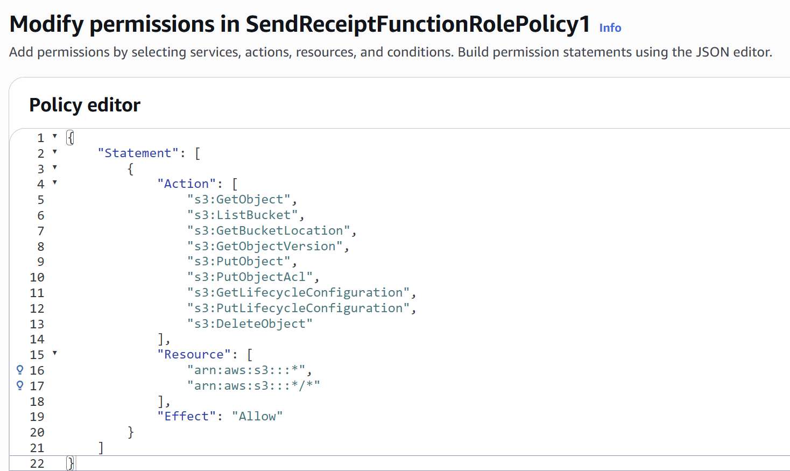

The DynamoDB policy allowed broad table actions on wildcard table resources instead of only the required DVSA tables.

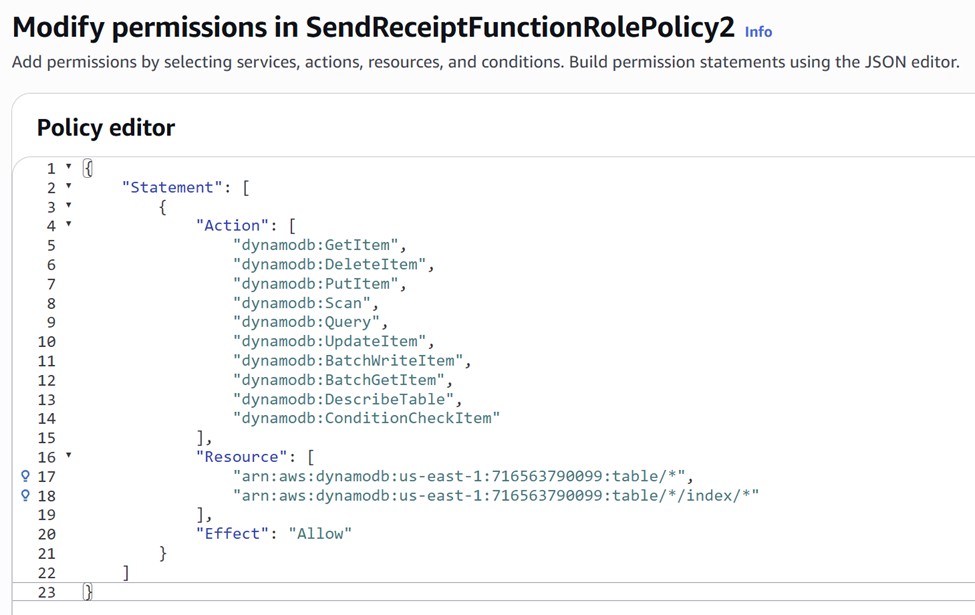

One STS policy contained a misspelled action: `sts:GetCallerIdentify` instead of `sts:GetCallerIdentity`. This policy was ineffective and showed poor policy review.

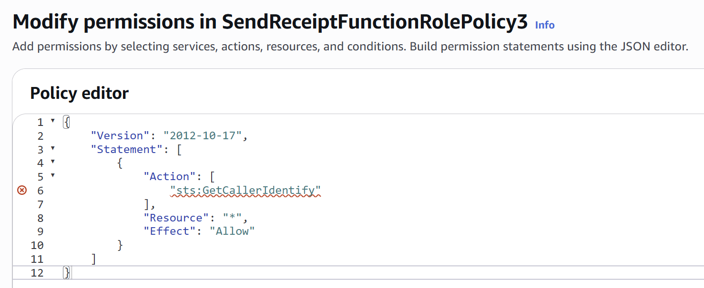

The role also had `AmazonSESFullAccess`, which grants far more permissions than the function needs. The function only needs to send receipt emails.

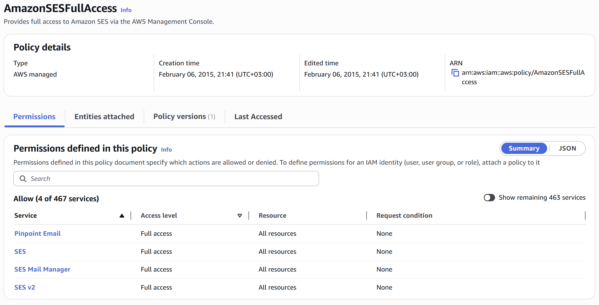

---

### Phase C: Prove Over-Privilege Using IAM Policy Simulator

1. From the role page, open **IAM Policy Simulator**.
2. Make sure all attached policies are selected.
3. Select **Amazon S3**.
4. Test actions such as `GetObject`, `PutObject`, and `DeleteObject` against an unrelated bucket ARN.
5. Run the simulation.
6. Repeat with **Amazon DynamoDB** using actions such as `Scan`, `GetItem`, `PutItem`, and `DeleteItem` against an unrelated table ARN.

The expected insecure result is that the role is allowed to perform actions on resources that are not part of the receipt workflow.

**Evidence - S3 access allowed on unrelated bucket:**

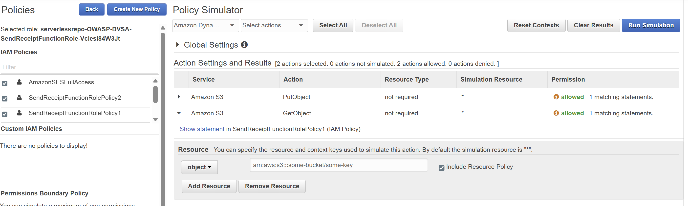

**Evidence - DynamoDB access allowed on unrelated table:**

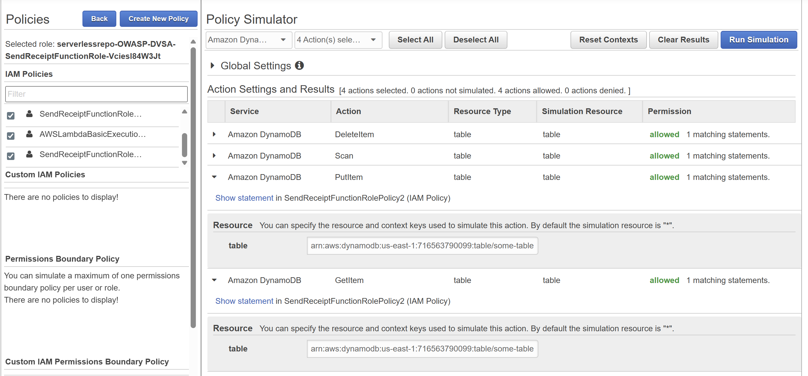

---

### Phase D: Compare Real Usage with CloudTrail Policy Generation

1. Create or enable a CloudTrail trail named `dvsa-policygen-trail`.
2. Trigger the receipt function by completing an order in the DVSA application.
3. Confirm the function ran by checking CloudWatch logs.
4. Go to IAM and generate a policy based on CloudTrail events for the function role.
5. Compare the generated policy with the currently attached policies.

The generated policy shows that the function actually uses a much smaller permission set than the role currently grants.

**Evidence - CloudTrail logging enabled:**

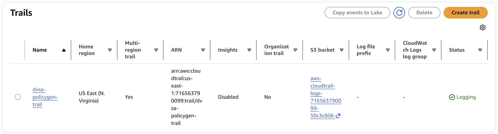

**Evidence - Receipt Lambda function executed:**

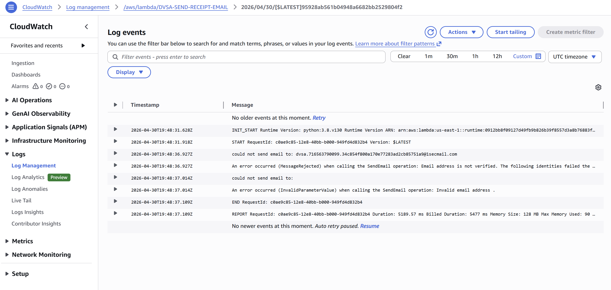

**Evidence - IAM Generate Policy shows limited actions:**

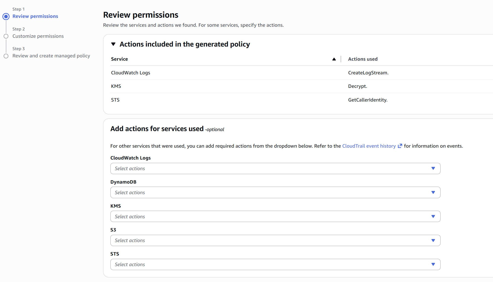

**Evidence - Generated minimal policy JSON:**

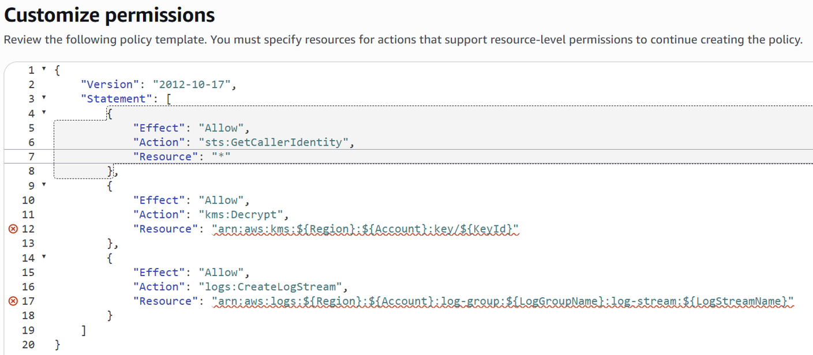

---

### Phase E: Controlled Impact Demonstration

This phase demonstrates what could happen if the Lambda function were compromised. It should only be done in a controlled lab environment.

1. Temporarily add environment-printing instrumentation to the Lambda function.
2. Trigger the Lambda function again.
3. Review the CloudWatch logs and verify that temporary credential fields are present.
4. Redact all credential values before storing evidence.
5. Use the temporary credentials locally to verify the assumed Lambda role identity.
6. Test whether the assumed role can access S3 and DynamoDB beyond what the receipt workflow requires.
7. Remove the temporary print statement immediately after capturing evidence.

**Evidence - Temporary environment-printing instrumentation:**

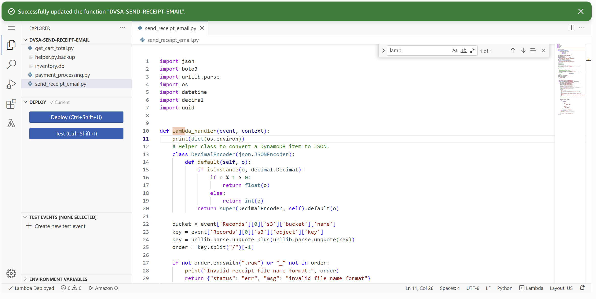

**Evidence - CloudWatch environment dictionary with credentials redacted:**

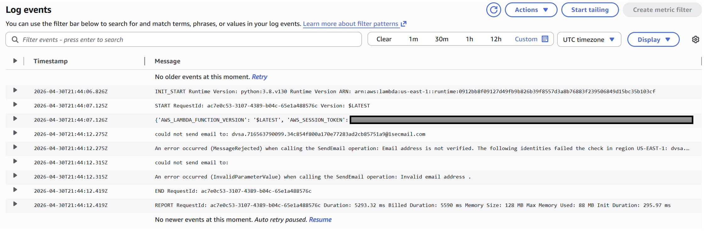

**Evidence - Local terminal operating as the Lambda role:**

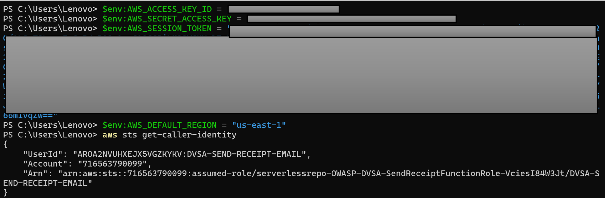

**Evidence - S3 list succeeds using the Lambda identity:**

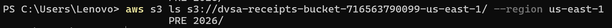

**Evidence - DynamoDB scan succeeds using the Lambda identity:**

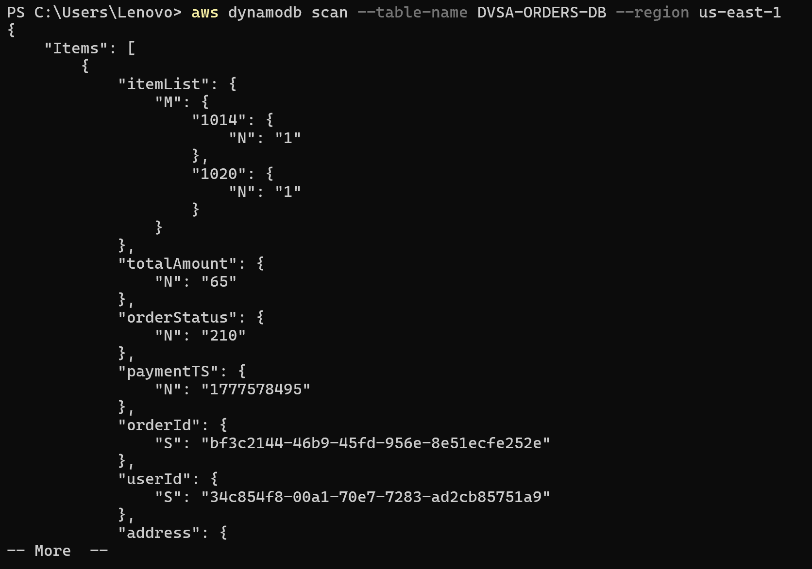

**Evidence - Recursive receipt bucket listing:**

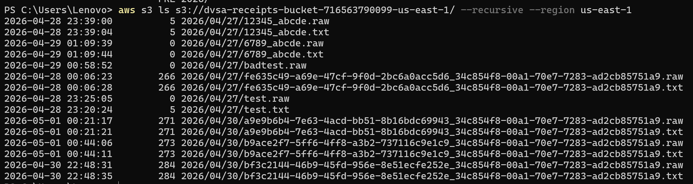

**Evidence - Receipt download demonstration with details redacted:**

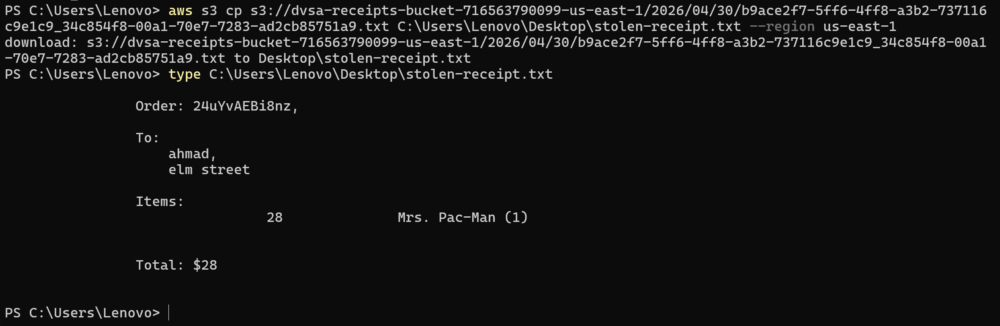

---

## 6. Attack Result Summary (Before Fix)

| What was tested | Result |
|---|---|
| S3 actions on unrelated bucket | Allowed by IAM Policy Simulator |
| DynamoDB actions on unrelated table | Allowed by IAM Policy Simulator |
| CloudTrail-generated usage comparison | Showed the function used far fewer permissions than granted |
| Assumed Lambda role identity | Confirmed using AWS CLI |
| S3 receipt listing using Lambda identity | Succeeded |
| DynamoDB scan using Lambda identity | Succeeded |
| Blast radius | Larger than the receipt-email workflow requires |

The evidence shows that the function role could access resources beyond its intended purpose. This is dangerous because any compromise of the Lambda function would inherit the role's excessive permissions.

---

## 7. Fix Strategy

The fix is to apply IAM least privilege to the Lambda execution role.

The role should only have the exact permissions needed for the receipt-email workflow:

- Scope S3 access to the DVSA receipts bucket only.
- Allow only required S3 actions such as `s3:GetObject` and `s3:PutObject`.
- Scope DynamoDB permissions to the required DVSA tables only.
- Allow only required DynamoDB actions such as `dynamodb:GetItem` and `dynamodb:UpdateItem`.
- Delete the invalid STS policy with the misspelled action.
- Remove `AmazonSESFullAccess`.
- Replace it with a minimal SES send-only policy.
- Verify the final role using IAM Policy Simulator and a real application workflow.

---

## 8. Code / Config Changes

### Change 1: Scope S3 Access to the Receipts Bucket

The old S3 policy allowed broad access to wildcard bucket resources. It was replaced with a policy scoped to the DVSA receipts bucket.

```json
{
  "Effect": "Allow",
  "Action": [
    "s3:GetObject",
    "s3:PutObject"
  ],
  "Resource": "arn:aws:s3:::dvsa-receipts-bucket-716563790099-us-east-1/*"
}
```

**Evidence - Fixed S3 policy:**

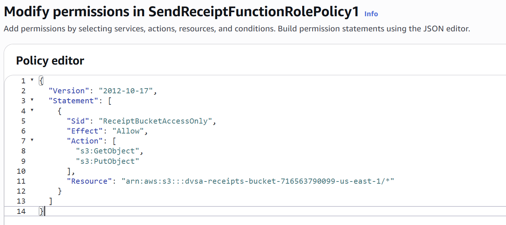

---

### Change 2: Scope DynamoDB Access to Required Tables

The old DynamoDB policy allowed broad table actions. It was replaced with a policy limited to the real DVSA tables and only the required actions.

```json
{
  "Effect": "Allow",
  "Action": [
    "dynamodb:GetItem",
    "dynamodb:UpdateItem"
  ],
  "Resource": [
    "arn:aws:dynamodb:us-east-1:716563790099:table/DVSA-ORDERS-DB",
    "arn:aws:dynamodb:us-east-1:716563790099:table/DVSA-USERS-DB"
  ]
}
```

**Evidence - Fixed DynamoDB policy:**

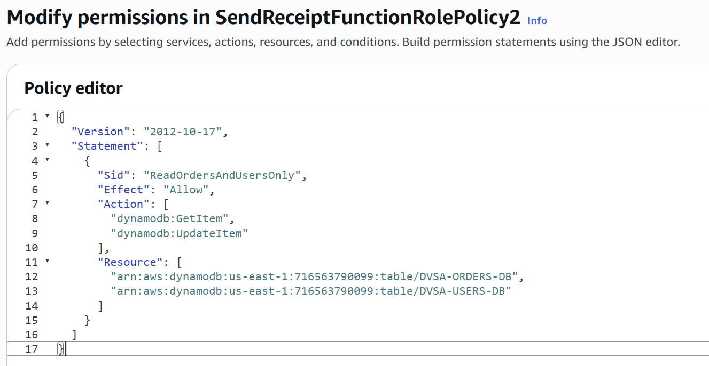

---

### Change 3: Delete Invalid STS Policy

The invalid policy containing the misspelled action `sts:GetCallerIdentify` was removed.

**Evidence - Deleting invalid STS policy:**

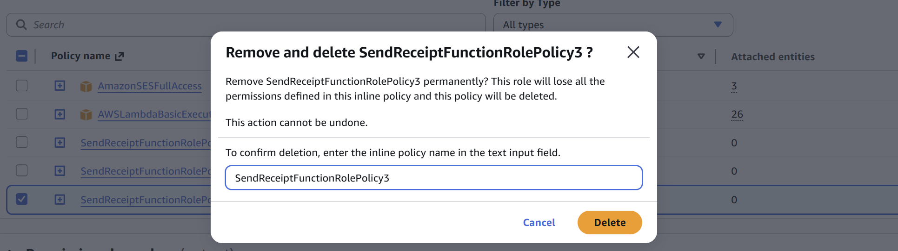

---

### Change 4: Replace AmazonSESFullAccess with Send-Only SES Policy

The over-broad `AmazonSESFullAccess` managed policy was detached.

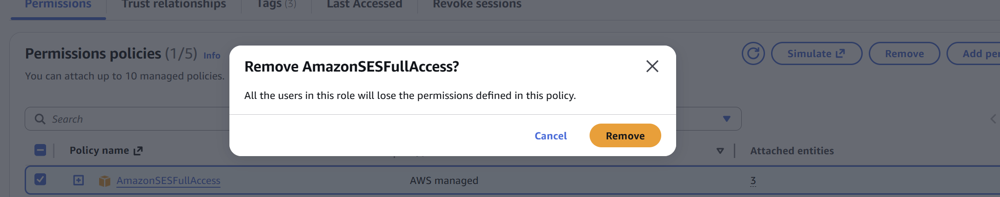

A new minimal SES policy was added to allow only email sending.

```json
{
  "Effect": "Allow",
  "Action": [
    "ses:SendEmail",
    "ses:SendRawEmail"
  ],
  "Resource": "*"
}
```

**Evidence - New SES send-only policy:**

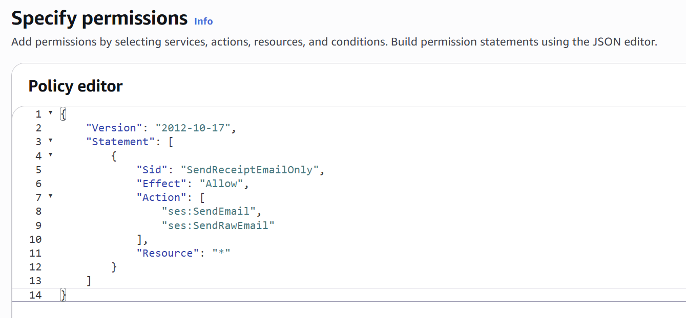

**Evidence - Final policy list after cleanup:**

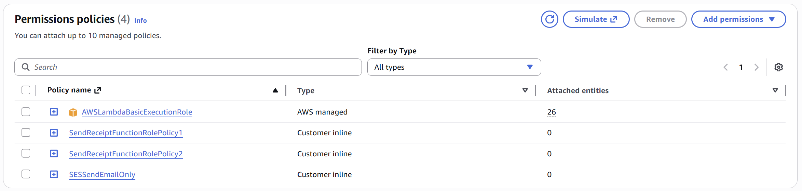

---

## 9. Verification After Fix

After applying the least-privilege policy changes, the same IAM Policy Simulator tests were repeated.

### Verification 1: Random S3 Bucket Access Denied

The role can no longer access unrelated S3 buckets.

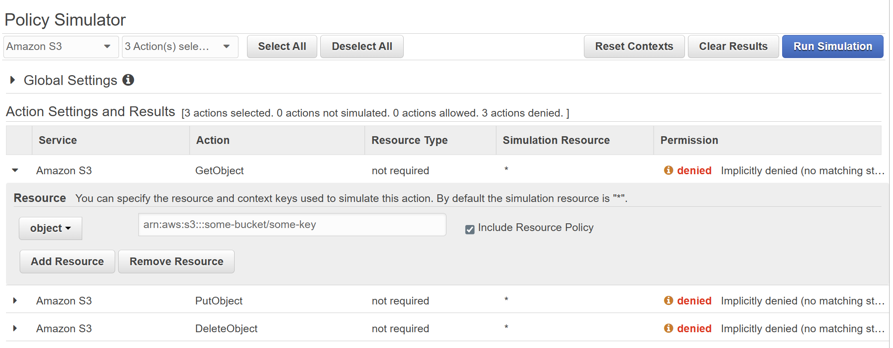

---

### Verification 2: Required Receipt Bucket Access Still Works

The role can still perform required access on the receipts bucket, but destructive actions such as `DeleteObject` are denied.

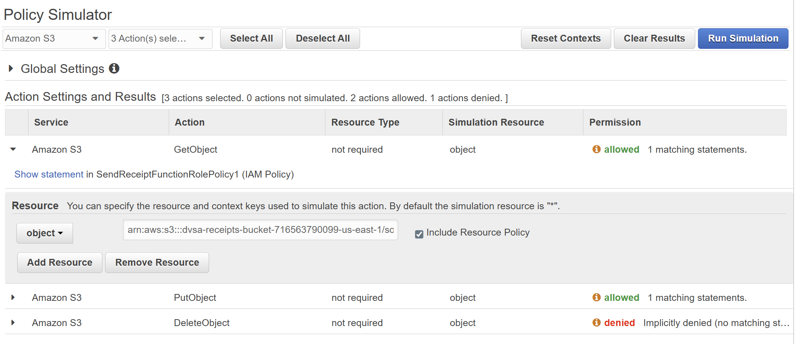

---

### Verification 3: Unrelated DynamoDB Table Access Denied

The role can no longer access unrelated DynamoDB tables.

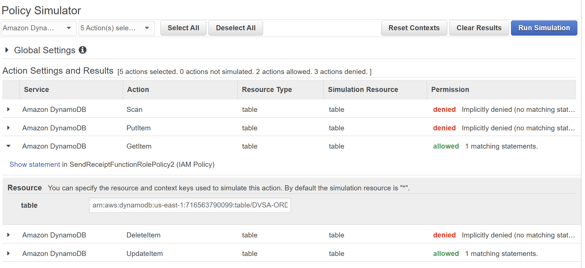

---

### Verification 4: Required DynamoDB Actions Preserved

The role can still perform the required `GetItem` and `UpdateItem` actions on the real DVSA orders table, while broader actions such as `Scan`, `PutItem`, and `DeleteItem` are denied.

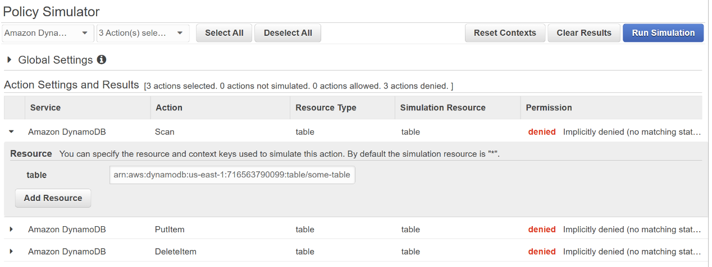

---

### Verification 5: SES Send Actions Preserved

The role can still send emails using `ses:SendEmail` and `ses:SendRawEmail`.

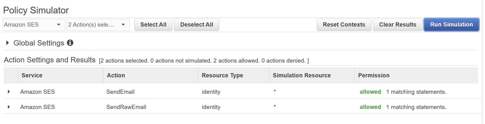

---

### Verification 6: Normal Application Workflow Still Works

A normal DVSA order was placed successfully after the IAM restrictions were applied.

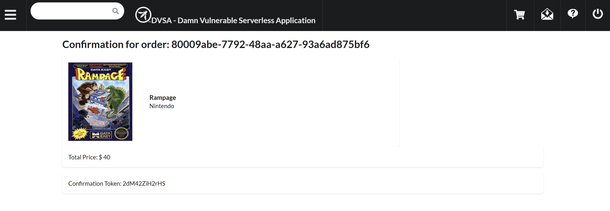

CloudWatch logs confirmed the Lambda function executed without IAM `AccessDenied` errors after the fix.

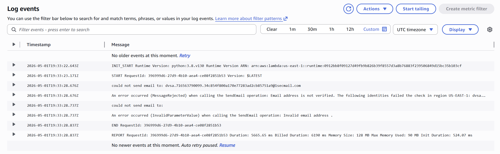

---

## 10. Security Analysis

### Intended Logic

The receipt-email Lambda function should only perform tasks related to the receipt workflow:

```text
DVSA order completed → Receipt file stored/read → Receipt email sent → Logs written
```

It should not have broad access to unrelated S3 buckets, unrelated DynamoDB tables, or full SES administration.

### Table 1 - Intended vs. Observed Behavior

| Vulnerability | Intended Rule(s) | Artifacts Used | Normal Behavior Evidence | Exploit Behavior Evidence |
|---|---|---|---|---|
| Over-Privileged Function | The Lambda role must allow only the exact actions and resources needed for the receipt workflow. | IAM policies, IAM Policy Simulator results, CloudTrail generated policy, CloudWatch logs, AWS CLI assumed-role test | CloudTrail generated policy showed a small set of observed actions during the receipt workflow. | IAM Policy Simulator and assumed-role testing showed broad S3 and DynamoDB access beyond the function purpose. |

### Table 2 - Deviation Analysis and Fix

| Vulnerability | Why This Is a Deviation | Deviation Class | Fix Applied | Post-Fix Verification | Latency |
|---|---|---|---|---|---|
| Over-Privileged Function | The execution role granted wildcard access that was unnecessary for sending receipt emails, increasing the impact of any function compromise. | Accidental misconfiguration / over-permissive IAM design | Restricted S3, DynamoDB, and SES permissions; deleted invalid STS policy; detached AmazonSESFullAccess | Post-fix simulator denied unrelated S3/DynamoDB access while preserving needed receipt and email actions | Not measured |

---

## 11. Lessons Learned

In serverless applications, the Lambda execution role is a major security boundary. If the function is compromised, the attacker can use whatever the role allows.

This lesson shows that broad IAM permissions turn a small function compromise into a much larger data exposure risk. The receipt-email function did not need account-wide S3 access, broad DynamoDB actions, or full SES administration. Those permissions increased the blast radius unnecessarily.

The correct approach is to start with minimal permissions and expand only when real application behavior requires it. Tools such as CloudTrail policy generation, IAM Policy Simulator, and CloudWatch logs help identify which permissions are actually needed and which ones can be removed.

The most important takeaway is: **least privilege is not optional in serverless systems. It is the main boundary that limits damage when something goes wrong.**

---

## Repository Structure

```text
lesson7_over_privileged_functions/
│
├── README.md
├── evidence/
│   ├── 00_evidence_contact_sheet.png
│   ├── figure16_cli_setup_identity.png
│   ├── figure17_lambda_execution_role.png
│   ├── figure18_role_attached_policies.png
│   ├── figure19_s3_wildcard_policy.png
│   ├── figure20_dynamodb_wildcard_policy.png
│   ├── figure21_sts_typo_policy.png
│   ├── figure22_amazon_ses_full_access.png
│   ├── figure23_simulator_s3_allowed_random_bucket.png
│   ├── figure24_simulator_dynamodb_allowed_unrelated_table.png
│   ├── figure25_cloudtrail_logging_enabled.png
│   ├── figure26_cloudwatch_function_ran.png
│   ├── figure27_iam_generate_policy_review.png
│   ├── figure28_generated_minimal_policy_json.png
│   ├── figure29_temp_environment_print_instrumentation.png
│   ├── figure30_cloudwatch_redacted_environment_credentials.png
│   ├── figure31_local_terminal_assumed_lambda_role.png
│   ├── figure32_s3_list_assumed_role_success.png
│   ├── figure33_dynamodb_scan_assumed_role_success.png
│   ├── figure34_recursive_receipt_bucket_listing.png
│   ├── figure35_receipt_download_demo_redacted.png
│   ├── figure36_fixed_s3_policy_scoped_receipts.png
│   ├── figure37_fixed_dynamodb_policy_scoped_tables.png
│   ├── figure38_delete_invalid_sts_policy.png
│   ├── figure39_detach_amazon_ses_full_access.png
│   ├── figure40_new_ses_send_only_policy.png
│   ├── figure41_final_role_policy_list.png
│   ├── figure42_postfix_s3_random_bucket_denied.png
│   ├── figure43_postfix_s3_receipt_bucket_allowed_delete_denied.png
│   ├── figure44_postfix_dynamodb_unrelated_table_denied.png
│   ├── figure45_postfix_dynamodb_orders_limited_actions.png
│   ├── figure46_postfix_ses_send_only_allowed.png
│   ├── figure47_successful_order_after_fix.png
│   └── figure48_cloudwatch_no_iam_accessdenied_after_fix.png
│
├── payloads/
│   ├── s3_receipt_bucket_access_only.json
│   ├── dynamodb_required_tables_only.json
│   ├── ses_send_email_only.json
│   └── policy_simulator_test_resources.txt
│
└── snippets/
    ├── aws_cli_assumed_role_test.ps1
    ├── cloudtrail_policy_generation_steps.md
    ├── iam_policy_simulator_tests.md
    ├── temporary_lambda_instrumentation.py
    └── cleanup_checklist.md
```
